# PetroWeb Frota — Modelagem de Dados

> ERD, dicionário de dados e convenções de migration.
> Documento complementar a `01_DOCUMENTO_MESTRE.md`. Versão 1.3 — 21/08/2026.

---

## 1. Convenções gerais

Estas convenções valem para **todas** as tabelas de negócio. Divergência precisa de justificativa escrita.

| Convenção | Regra |
|---|---|
| Nomes | Tabelas no plural e em português (`veiculos`, `ordens_coleta`); colunas em `snake_case` |
| Chave primária | `id` — `bigIncrements` |
| Tenant | `empresa_id` **NOT NULL** em toda tabela de negócio, primeiro campo do índice composto |
| Filial | `filial_id` nas tabelas com relevância fiscal ou operacional por estabelecimento |
| Timestamps | `created_at`, `updated_at` em tudo; `deleted_at` (soft delete) em cadastros — **nunca** em documentos fiscais |
| Auditoria | `created_by`, `updated_by` (FK `usuarios`) em documentos fiscais e financeiros |
| Monetário | `decimal(15,2)` (vira `numeric` no Postgres); quantidades `decimal(15,4)`; alíquotas `decimal(7,4)` — **nunca** `float` |
| Peso | `decimal(15,4)` em quilogramas; volume em m³ `decimal(15,4)` |
| Enums | Coluna `string` curta + constante em classe PHP, **nunca** tipo `ENUM` de banco — no Postgres `ALTER TYPE` não roda dentro de transação |
| Chaves de acesso DF-e | `char(44)`, com índice único por empresa |
| Datas fiscais | `datetime` com timezone armazenado em UTC; exibição em `America/Bahia` ou fuso da filial |
| Unicidade | Sempre composta com `empresa_id`: `unique(empresa_id, placa)`. Busca insensível a caixa usa índice em `lower()` |
| Soft delete em fiscal | Proibido. Documento fiscal não se apaga — muda de status |

> ⚠️ **O banco é PostgreSQL 16**, o mesmo do PetroWeb — não MySQL. Isso muda pouco no Eloquent e bastante em SQL cru: `decimal` é `numeric`, `json` é `jsonb`, e `ALTER TYPE` de enum não roda em transação. Em compensação ganhamos **índices parciais** e **constraints EXCLUDE** — a regra de um MDF-e aberto por veículo (RN-03) pode virar restrição de banco em vez de validação de aplicação. Ver `06_ARRANQUE_E_INFRA.md`, seção 2.

**Índices obrigatórios em toda tabela de negócio:**

```php
$table->index(['empresa_id', 'created_at']);
$table->index(['empresa_id', 'status']);   // quando houver status
```

---

## 2. Visão macro dos domínios

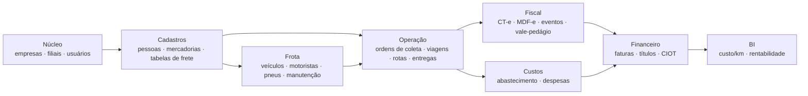

---

## 3. Núcleo e plataforma

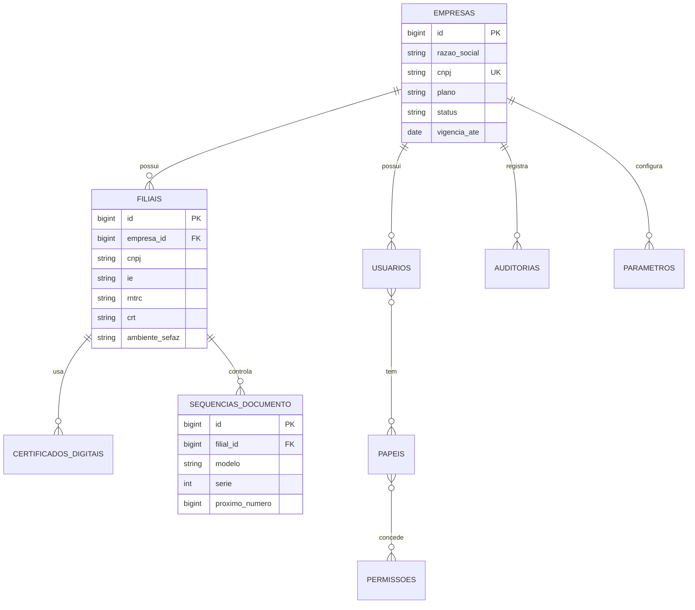

### 3.1 `empresas` (tenant)

| Coluna | Tipo | Obrig. | Descrição |
|---|---|---|---|
| `id` | bigint PK | ✔ | |
| `razao_social` | string(150) | ✔ | |
| `nome_fantasia` | string(150) | | |
| `cnpj` | char(14) UK | ✔ | Único global (é o tenant) |
| `plano` | string(30) | ✔ | `starter` \| `pro` \| `enterprise` |
| `status` | string(20) | ✔ | `ativa` \| `suspensa` \| `cancelada` |
| `vigencia_ate` | date | | Bloqueio por inadimplência |
| `timezone` | string(40) | ✔ | Padrão `America/Sao_Paulo` |
| `parametros` | jsonb | | Configurações livres do tenant |

### 3.2 `filiais` (estabelecimento emitente)

| Coluna | Tipo | Obrig. | Descrição |
|---|---|---|---|
| `empresa_id` | bigint FK | ✔ | |
| `codigo` | string(10) | ✔ | Único por empresa |
| `razao_social`, `nome_fantasia` | string(150) | ✔ | |
| `cnpj` | char(14) | ✔ | Único por empresa |
| `ie` | string(20) | ✔ | Inscrição estadual |
| `im` | string(20) | | Inscrição municipal |
| `crt` | string(1) | ✔ | Código de regime tributário: `1` Simples, `2` Simples excesso, `3` Regime normal |
| `rntrc` | string(10) | | Registro ANTT — obrigatório para TRC |
| `endereco_*` | — | ✔ | Logradouro, número, bairro, `municipio_id`, CEP |
| `ambiente_sefaz` | string(1) | ✔ | `1` produção, `2` homologação |
| `uf_autorizadora` | string(2) | ✔ | Pode diferir da UF do endereço (SVRS/SVSP) |
| `certificado_id` | bigint FK | | Certificado ativo |
| `logo_path` | string | | Para o DACTE |

### 3.3 `certificados_digitais`

| Coluna | Tipo | Descrição |
|---|---|---|
| `filial_id` | bigint FK | |
| `arquivo_path` | string | Caminho do `.pfx` no storage privado |
| `senha_encriptada` | text | **Criptografada com a chave da aplicação — nunca em texto puro** |
| `cnpj_titular` | char(14) | Validado contra o CNPJ da filial no upload |
| `valido_de`, `valido_ate` | datetime | Alerta automático em D-30 |
| `status` | string(20) | `ativo` \| `vencido` \| `revogado` |

### 3.4 `sequencias_documento`

Controle de numeração — ver RN-06 do documento mestre.

| Coluna | Tipo | Descrição |
|---|---|---|
| `filial_id` | bigint FK | |
| `modelo` | string(2) | `57` CT-e, `58` MDF-e, `67` CT-e OS, `64` GTV-e |
| `serie` | int | |
| `proximo_numero` | bigint | Incrementado sob `lockForUpdate()` |

`unique(filial_id, modelo, serie)`.

### 3.5 `auditorias`

`empresa_id`, `usuario_id`, `auditavel_type`, `auditavel_id`, `evento` (`criado`/`alterado`/`cancelado`), `valores_antes` (json), `valores_depois` (json), `ip`, `user_agent`, `motivo` (text), `created_at`.

---

## 4. Cadastros

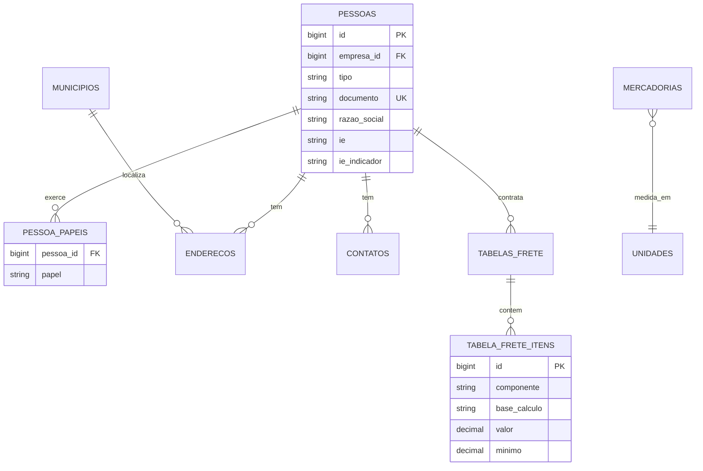

### 4.1 `pessoas` (modelo unificado)

Uma única tabela para cliente, fornecedor, motorista, proprietário, oficina e seguradora. Os papéis ficam em `pessoa_papeis`.

| Coluna | Tipo | Obrig. | Descrição |
|---|---|---|---|
| `empresa_id` | bigint FK | ✔ | |
| `tipo` | string(1) | ✔ | `F` física, `J` jurídica, `E` estrangeiro |
| `documento` | string(20) | ✔ | CPF/CNPJ, apenas dígitos. `unique(empresa_id, documento)` |
| `razao_social` | string(150) | ✔ | Nome, para pessoa física |
| `nome_fantasia` | string(150) | | |
| `ie` | string(20) | | |
| `ie_indicador` | string(1) | ✔ | `1` contribuinte, `2` isento, `9` não contribuinte — **crítico no CT-e** |
| `rntrc` | string(10) | | Quando proprietário/transportador |
| `suframa` | string(9) | | Inscrição SUFRAMA — exigida pela NT 2026.002 em ALC |
| `email`, `telefone` | string | | Principais |
| `observacoes` | text | | |
| `ativo` | boolean | ✔ | |

### 4.2 `pessoa_papeis`

`pessoa_id`, `papel` (`cliente` \| `fornecedor` \| `motorista` \| `proprietario` \| `oficina` \| `seguradora` \| `posto`), `dados` (json com atributos específicos do papel). `unique(pessoa_id, papel)`.

### 4.3 `enderecos`

`pessoa_id`, `tipo` (`principal`/`coleta`/`entrega`/`cobranca`), `logradouro`, `numero`, `complemento`, `bairro`, `municipio_id` (FK), `cep`, `latitude`, `longitude`, `principal` (bool).

### 4.4 `municipios` (tabela fiscal, global — sem `empresa_id`)

`codigo_ibge` (char 7, UK), `nome`, `uf`, `codigo_uf`, `latitude`, `longitude`. **Obrigatória** — o CT-e exige código IBGE de município de início e fim da prestação.

### 4.5 `mercadorias`

O cadastro completo, com todos os blocos e a fundamentação das classificações, está em **`05_CADASTROS_E_TABELAS_DE_DOMINIO.md`**, seções 7 a 9. Aqui ficam apenas as colunas.

**Identificação e fiscal:** `empresa_id`, `codigo_interno`, `descricao`, `descricao_complementar`, `marca`, `ncm` (8), `cest` (7), `gtin`, `gtin_tributavel`, `unidade_comercial`, `unidade_tributavel`, `cunid_cte` (2), `cunid_mdfe` (2), `ativo`.

**Físico e logístico:** `peso_bruto_kg`, `peso_liquido_kg`, `comprimento_m`, `largura_m`, `altura_m`, `volume_m3` (calculado), `densidade_kg_m3`, `fator_cubagem_kg_m3`, `empilhamento_max_camadas`, `permite_empilhar`, `carga_max_sobre_topo_kg`, `fragil`, `sentido_obrigatorio`.

**Natureza:** `natureza_carga_id` (FK), `carroceria_recomendada_id` (FK).

**Temperatura:** `exige_temp_controlada`, `temp_min_c`, `temp_max_c`, `exige_registro_continuo`.

**Produto perigoso:** `eh_perigoso`, `produto_perigoso_id` (FK para a Relação ONU), `num_onu` (4), `nome_embarque` (150), `classe_risco` (10), `risco_subsidiario` (20), `num_risco` (4), `grupo_embalagem` (3), `provisoes_especiais`, `qtd_lim_veiculo`, `qtd_lim_emb_interna`, `ponto_fulgor_c`, `risco_ambiental`, `exige_mopp`, `exige_kit_9735`, `temp_controle_c`, `temp_emergencia_c`.

**Controles setoriais:** `pce_exercito`, `exige_guia_trafego`, `controlado_pf`, `exige_mapa_siproquim`, `origem_animal`, `tipo_inspecao`, `numero_registro_inspecao`, `eh_agrotoxico`, `registro_mapa`.

> ⚠️ **Correção em relação à v1.1 desta documentação.** Os campos de produto perigoso alimentam o grupo `peri` **do MDF-e**, dentro de `infCTe` e `infNFe` sob `infMunDescarga`. O **modal rodoviário do CT-e não tem grupo `peri`** — ele existe no CT-e apenas no modal aéreo. Ver `05_CADASTROS_E_TABELAS_DE_DOMINIO.md`, seção 8.4.

> `ponto_fulgor_c` **não é transmitido em nenhum DF-e** — é atributo de cadastro, vindo da FISPQ, usado para derivar automaticamente o grupo de embalagem da Classe 3.

### 4.6 `tabelas_frete` e `tabela_frete_itens`

`tabelas_frete`: `empresa_id`, `pessoa_id` (cliente, nulo = tabela geral), `descricao`, `vigencia_inicio`, `vigencia_fim`, `uf_origem`, `uf_destino`, `municipio_origem_id`, `municipio_destino_id`, `tipo_veiculo`, `ativo`.

`tabela_frete_itens`: `tabela_frete_id`, `componente` (`peso` \| `valor` \| `gris` \| `advalorem` \| `pedagio` \| `tde` \| `tda` \| `taxa_entrega` \| `outros`), `base_calculo` (`por_kg` \| `por_ton` \| `percentual_valor` \| `fixo` \| `por_km` \| `por_volume`), `faixa_de`, `faixa_ate`, `valor`, `minimo`, `maximo`.

---

### 4.7 Tabelas de domínio

Conteúdo completo, com os valores prontos para seed e a fundamentação, em **`05_CADASTROS_E_TABELAS_DE_DOMINIO.md`**. Aqui fica só a estrutura.

**Princípio:** enum fiscal e tabela operacional são coisas diferentes. O operador escolhe "Sider" ou "Tanque"; o sistema traduz para o código da SEFAZ. **Nenhuma tela de operação mostra código fiscal ao usuário.**

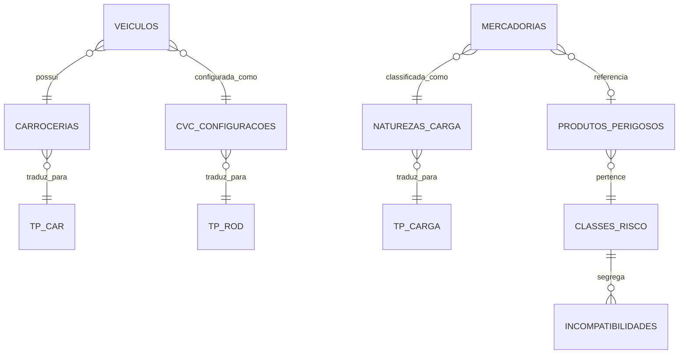

**Enums fiscais** (globais, read-only, sem `empresa_id`): `tp_rod` (6), `tp_car` (6), `tp_carga` (12), `categ_comb_veic` (**10**), `tp_transp` (3), `tp_unid_transp` (7), `tp_unid_carga` (4), `cunid_cte` (6), `cunid_mdfe` (2). Estrutura: `codigo` varchar, `descricao`, `ativo`.

> ⚠️ **`categ_comb_veic` tem 10 valores, não 13** — os códigos `03`, `05` e `09` não existem. Gerar o código por aritmética simples produz XML inválido.
>
> ⚠️ **`cunid_cte` e `cunid_mdfe` são enums distintos** — 6 valores contra 2. Não compartilhe a mesma tabela.

**Tabelas operacionais** (com `empresa_id` nulo para os registros padrão do sistema):

| Tabela | Colunas principais |
|---|---|
| `carrocerias` | `codigo`, `nome`, `tp_car_fiscal`, `natureza_padrao`, `exige_temperatura_controlada`, `exige_civ_cipp`, `exige_certificacao_inmetro`, `aceita_produto_perigoso`, `permite_conteiner`, `capacidade_m3_referencia`, `ativo` |
| `naturezas_carga` | `codigo`, `nome`, `tp_carga_base`, `permite_perigosa`, `exige_temperatura`, `exige_aet`, `exige_gta`, `carroceria_recomendada_id` |
| `cvc_configuracoes` | `nome_popular`, `slug`, `eixos`, `qtd_unidades`, `tracao`, `pbtc_kg`, `comprimento_max_m`, `capacidade_min_kg`, `capacidade_max_kg`, `exige_aet`, `tp_rod_default`, `cnh_minima` |

**Tabelas de referência de produto perigoso** (globais, sincronizadas):

| Tabela | Colunas |
|---|---|
| `classes_risco` | `codigo` (`1.1`, `2.3`, `6.1`…), `classe`, `subclasse`, `descricao` |
| `grupos_compatibilidade` | `letra` (A…S, sem I), `descricao` — só para Classe 1 |
| `produtos_perigosos` | As 9 colunas da Relação: `num_onu` (4), `nome_embarque` (150), `classe_risco` (10), `risco_subsidiario` (20), `num_risco` (4), `grupo_embalagem` (3), `provisoes_especiais`, `qtd_lim_veiculo`, `qtd_lim_emb_interna` |
| `incompatibilidades` | `classe_a`, `classe_b`, `situacao` (`permitido` \| `proibido` \| `condicionado`), `nota_condicao` |
| `incompatibilidades_onu` | `num_onu_a`, `num_onu_b`, `situacao`, `observacao` — exceções por produto |

> **"Zero" nas colunas 8 e 9 da Relação significa transporte não permitido** naquele regime, não ausência de limite. Modele como nullable + flag, não como `0`.

---

## 5. Frota

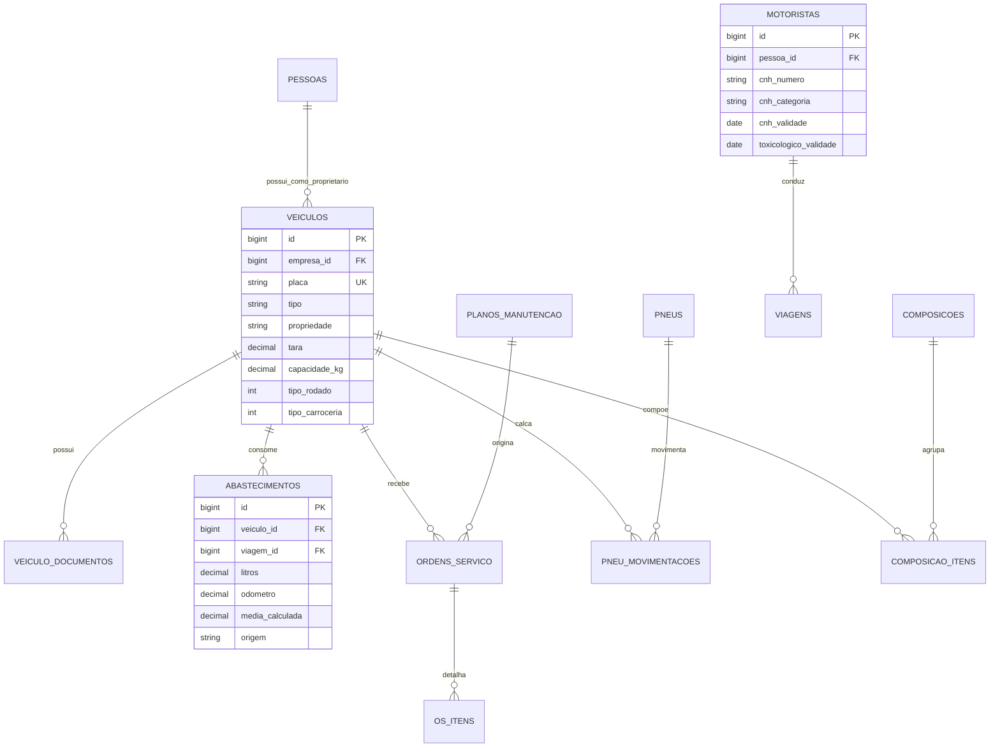

### 5.1 `veiculos`

| Coluna | Tipo | Obrig. | Descrição |
|---|---|---|---|
| `empresa_id`, `filial_id` | bigint FK | ✔ | |
| `placa` | string(7) | ✔ | `unique(empresa_id, placa)`. Aceita Mercosul |
| `renavam` | string(11) | | |
| `chassi` | string(17) | | |
| `tipo` | string(20) | ✔ | `tracao` \| `reboque` \| `semirreboque` \| `dolly` |
| `propriedade` | string(20) | ✔ | `propria` \| `arrendada` \| `agregada` \| `terceiro` |
| `proprietario_id` | bigint FK `pessoas` | | Obrigatório quando não `propria` — leva RNTRC ao MDF-e |
| `proprietario_tp_transp` | string(1) | | `1` ETC, `2` TAC, `3` CTC |
| `contrato_agregacao_id` | bigint FK | | Quando `propriedade = agregada` |
| `marca`, `modelo` | string(60) | | |
| `ano_fabricacao`, `ano_modelo` | smallint | | |
| `cor` | string(20) | | |
| **Configuração física** | | | |
| `tara_kg` | decimal(15,4) | ✔ | Do CRLV. Campo do MDF-e |
| `pbt_kg`, `pbtc_kg` | decimal(15,4) | | Do CRLV e da configuração de CVC |
| `capacidade_kg` | decimal(15,4) | ✔ | **Calculado:** `pbtc_kg − tara_kg`. Campo do MDF-e |
| `capacidade_m3` | decimal(15,4) | | Campo do MDF-e |
| `comprimento_m`, `largura_m`, `altura_m` | decimal(8,3) | | Restrição de rota (túnel, ponte, gabarito) |
| `tipo_rodado` | string(2) | ✔ | `tpRod` — só para tração. `01` truck, `02` toco, `03` cavalo mecânico, `04` VAN, `05` utilitário, `06` outros |
| `tipo_carroceria` | string(2) | ✔ | `tpCar` — `00` não aplicável, `01` aberta, `02` fechada/baú, `03` **granelera**, `04` porta-container, `05` sider |
| `carroceria_id` | bigint FK | ✔ | Carroceria **de mercado** (baú, sider, tanque, silo…). Ver doc. 05, seção 4.2 |
| `cvc_configuracao_id` | bigint FK | | Configuração da combinação. Ver doc. 05, seção 3.3 |
| **`eixos`** | tinyint | ✔ | Base do `categCombVeic`. Sem isso, rejeição 731 |
| `tracao` | string(5) | | `4x2`, `6x2`, `6x4`, `8x2`, `8x4` |
| `qtd_compartimentos` | tinyint | | Tanques multicompartimentados |
| `compartimentos` | json | | Capacidade e produto por compartimento |
| `exige_aet` | boolean | | Derivado da CVC — PBTC > 57 t ou comprimento > 19,80 m |
| `uf_licenciamento` | char(2) | ✔ | |
| `municipio_licenciamento_id` | bigint FK | | |
| `combustivel` | string(20) | | `diesel_s10` \| `diesel_s500` \| `arla` (tanque auxiliar) |
| `capacidade_tanque` | decimal(10,2) | | |
| `media_referencia_kml` | decimal(8,3) | | Média esperada — base do alerta de desvio |
| `odometro_atual` | decimal(12,2) | | Atualizado por abastecimento e OS |
| `status` | string(20) | ✔ | `ativo` \| `manutencao` \| `inativo` \| `vendido` |
| `rastreador_id` | string(50) | | Fase 3 |

### 5.2 `composicoes` e `composicao_itens`

Uma composição é o conjunto tração + reboques usado em uma viagem.

`composicoes`: `empresa_id`, `descricao`, `veiculo_tracao_id`, `ativa`.
`composicao_itens`: `composicao_id`, `veiculo_id` (reboque), `ordem` (1..3).

> A composição pode ser fixa (cadastrada) ou montada na hora da viagem. A tabela `viagens` guarda a composição efetivamente usada, porque ela muda.

### 5.3 `motoristas`

> Fundamentação legal dos vínculos, requisitos de CNH, toxicológico e MOPP em `05_CADASTROS_E_TABELAS_DE_DOMINIO.md`, seção 6.

| Coluna | Tipo | Obrig. | Descrição |
|---|---|---|---|
| `pessoa_id` | bigint FK | ✔ | Papel `motorista` |
| **CNH** | | | |
| `cnh_numero` | string(11) | ✔ | |
| `cnh_categoria` | string(5) | ✔ | `B` \| `C` \| `D` \| `E`. **Combinação com acoplado ≥ 6.000 kg exige `E`** |
| `cnh_validade` | date | ✔ | **Bloqueia alocação quando vencida (RN-09)** |
| `cnh_primeira_habilitacao` | date | | Categoria C exige 1 ano prévio em B |
| `cnh_ear` | boolean | ✔ | Observação "Exerce Atividade Remunerada" — obrigatória para profissional |
| **Vínculo** | | | |
| `vinculo` | string(20) | ✔ | `clt` \| `agregado` \| `autonomo` \| `terceiro` |
| `tp_transp` | string(1) | | `1` ETC, `2` TAC, `3` CTC — só para agregado e autônomo |
| `rntrc` | string(10) | | **Próprio** do TAC; obrigatório para agregado e autônomo |
| `rntrc_validade` | date | | |
| `contrato_agregacao_id` | bigint FK | | Quando `vinculo = agregado` |
| `admissao`, `demissao` | date | | Só para `clt` |
| **Saúde e cursos** | | | |
| `toxicologico_data`, `toxicologico_validade` | date | | Periodicidade parametrizável, padrão **30 meses**. Bloqueia alocação |
| `mopp_validade` | date | | Ver nota abaixo |
| `curso_carga_indivisivel_validade` | date | | Exigido para AET e prancha |
| **Remuneração** | | | |
| `valor_diaria`, `percentual_comissao`, `valor_por_km` | decimal | | |
| `conta_pagamento` | json | | Dados bancários — o pagamento a TAC é **exclusivamente eletrônico** |
| `status` | string(20) | ✔ | `ativo` \| `afastado` \| `inativo` |

> ⚠️ **Sobre `mopp_validade`:** a Res. CONTRAN 1.020/2025 não estabelece prazo de validade para o CETPP, e a revogação expressa da Res. 789/2020 ainda não está clara. Mantenha o campo e faça o **bloqueio ser configurável** (`parametros.bloquear_por_mopp_vencido`), nunca fixo no código.

> ⚠️ **Regra de projeto — não modele jornada para agregado nem autônomo.** A Justiça do Trabalho reconhece vínculo quando encontra remuneração fixa desvinculada de viagem, controle de jornada e subordinação. Telas de jornada, escala e ponto existem **apenas** para `vinculo = clt`. Ver doc. 05, seção 6.4.

### 5.4 `contratos_agregacao`

| Coluna | Tipo | Descrição |
|---|---|---|
| `empresa_id` | bigint FK | |
| `pessoa_id` | bigint FK | O TAC agregado |
| `veiculo_id` | bigint FK | O veículo colocado a serviço |
| `numero`, `inicio`, `fim` | | |
| `exclusividade` | boolean | Característica legal do TAC-agregado (art. 4º, §1º) |
| `modalidade_remuneracao` | string(30) | `remuneracao_certa` \| `percentual_frete` \| `por_km` \| `por_viagem` |
| `valor_base`, `percentual` | decimal | |
| `rntrc` | string(10) | |
| `apolice_rctrc`, `apolice_rcdc`, `apolice_rcv` | string | Seguros **próprios** do TAC |
| `validade_apolices` | date | Bloqueia alocação quando vencida |
| `conta_pagamento` | json | Pagamento eletrônico obrigatório |
| `arquivo_contrato_path` | string | |
| `status` | string(20) | `vigente` \| `suspenso` \| `encerrado` |

### 5.5 `veiculo_documentos` (vencimentos)

Genérico, serve a veículo, motorista e contrato via `documentavel_type`/`documentavel_id`.

`empresa_id`, `documentavel_type`, `documentavel_id`, `tipo` (`licenciamento` \| `seguro` \| `antt_rntrc` \| `civ` \| `cipp` \| `ctpp` \| `certificacao_inmetro` \| `aet` \| `cronotacografo` \| `cnh` \| `toxicologico` \| `mopp` \| `curso_carga_indivisivel` \| `outros`), `numero`, `emissao`, `vencimento`, `valor`, `arquivo_path`, `bloqueia_operacao` (bool), `observacoes`.

Índice: `index(empresa_id, vencimento, bloqueia_operacao)` — é a consulta do painel de vencimentos.

> **CIV e CIPP/CTPP não são só data.** O art. 23 da Res. ANTT 5.998/2022 exige os **originais** em circulação no transporte de perigosos a granel. Guarde o arquivo, não apenas o vencimento.

### 5.6 `abastecimentos`

| Coluna | Tipo | Obrig. | Descrição |
|---|---|---|---|
| `empresa_id`, `filial_id` | bigint FK | ✔ | |
| `veiculo_id` | bigint FK | ✔ | |
| `viagem_id` | bigint FK | | Nulo = abastecimento fora de viagem |
| `motorista_id` | bigint FK | | |
| `posto_id` | bigint FK `pessoas` | | Papel `posto` |
| `data_hora` | datetime | ✔ | |
| `combustivel` | string(20) | ✔ | |
| `litros` | decimal(12,3) | ✔ | |
| `valor_litro`, `valor_total` | decimal(15,2) | ✔ | |
| `odometro` | decimal(12,2) | ✔ | |
| `tanque_cheio` | boolean | ✔ | Só se calcula média confiável entre dois tanques cheios |
| `km_percorrido` | decimal(12,2) | | Calculado |
| `media_calculada` | decimal(8,3) | | km/l |
| `desvio_percentual` | decimal(7,2) | | Contra `media_referencia_kml` do veículo |
| `alerta` | boolean | | `true` quando o desvio excede o limite parametrizado |
| `origem` | string(20) | ✔ | `manual` \| `app_motorista` \| `importacao` \| `petroweb` \| `cartao_frota` |
| `referencia_externa` | string(60) | | ID no sistema de origem — **chave da integração PetroWeb** |
| `nota_fiscal`, `arquivo_path` | string | | Comprovante |

### 5.7 Manutenção

`planos_manutencao`: `empresa_id`, `descricao`, `aplicavel_a` (modelo/tipo de veículo), `gatilho` (`km` \| `tempo` \| `ambos`), `intervalo_km`, `intervalo_dias`, `antecedencia_km`, `antecedencia_dias`, `ativo`.

`ordens_servico`: `empresa_id`, `filial_id`, `veiculo_id`, `numero`, `tipo` (`preventiva` \| `corretiva` \| `sinistro` \| `pneu` \| `revisao`), `plano_manutencao_id`, `oficina_id` (FK `pessoas`), `interna` (bool), `abertura`, `previsao`, `encerramento`, `odometro`, `viagem_id` (quebra em rota), `status` (`aberta` \| `em_execucao` \| `aguardando_peca` \| `encerrada` \| `cancelada`), `valor_pecas`, `valor_mao_obra`, `valor_total`, `observacoes`.

`os_itens`: `ordem_servico_id`, `tipo` (`peca` \| `servico`), `descricao`, `codigo`, `quantidade`, `valor_unitario`, `valor_total`, `garantia_ate`.

### 5.8 Pneus

`pneus`: `empresa_id`, `numero_fogo` (UK por empresa), `marca`, `modelo`, `medida`, `tipo` (`novo` \| `recapado`), `vida` (int — 0 novo, 1 primeira recapagem…), `valor_aquisicao`, `data_aquisicao`, `sulco_inicial`, `sulco_atual`, `km_acumulado`, `status` (`estoque` \| `em_uso` \| `conserto` \| `recapagem` \| `sucata`).

`pneu_movimentacoes`: `pneu_id`, `veiculo_id`, `posicao` (string, ex. `1DE`, `2TD`), `tipo` (`instalacao` \| `remocao` \| `rodizio` \| `conserto` \| `recapagem` \| `sucateamento`), `data`, `odometro`, `sulco`, `motivo`, `ordem_servico_id`.

O custo por km do pneu sai de `valor_aquisicao / km_acumulado` ao longo das vidas.

---

## 6. Operação

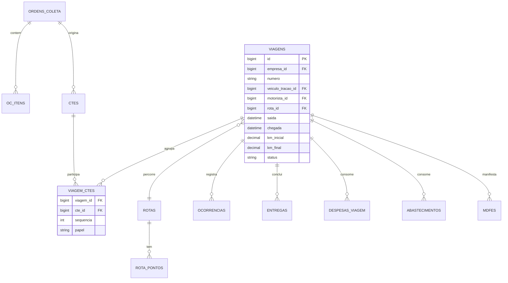

### 6.1 `ordens_coleta`

O documento de entrada da operação — vira CT-e.

`empresa_id`, `filial_id`, `numero`, `data`, `cliente_id`, `tomador_tipo` (`remetente` \| `destinatario` \| `expedidor` \| `recebedor` \| `outros`), `tomador_id`, `remetente_id`, `destinatario_id`, `expedidor_id`, `recebedor_id`, `endereco_coleta_id`, `endereco_entrega_id`, `municipio_inicio_id`, `municipio_fim_id`, `previsao_coleta`, `previsao_entrega`, `peso_bruto`, `peso_cubado`, `volumes`, `valor_mercadoria`, `tabela_frete_id`, `valor_frete_calculado`, `observacoes`, `status` (`aberta` \| `coletada` \| `faturada` \| `cancelada`).

`oc_itens`: `ordem_coleta_id`, `mercadoria_id`, `descricao`, `quantidade`, `unidade`, `peso`, `volume`, `valor`, `nfe_chave` (char 44), `nfe_numero`, `nfe_serie`.

> **Ponto de projeto:** as chaves de NF-e capturadas aqui alimentam o grupo `infNFe` do CT-e **e** o grupo de documentos do MDF-e. Capturar na entrada evita redigitação em dois lugares.

### 6.2 `viagens`

| Coluna | Tipo | Obrig. | Descrição |
|---|---|---|---|
| `empresa_id`, `filial_id` | bigint FK | ✔ | |
| `numero` | string(20) | ✔ | Sequencial por filial |
| `tipo` | string(20) | ✔ | `carga_lotacao` \| `fracionada` \| `transferencia` \| `carga_propria` \| `retorno_vazio` |
| `veiculo_tracao_id` | bigint FK | ✔ | |
| `composicao_snapshot` | json | ✔ | Placas dos reboques no momento da viagem |
| `motorista_id` | bigint FK | ✔ | |
| `motorista_2_id` | bigint FK | | Dupla de motoristas |
| `rota_id` | bigint FK | | |
| `municipio_origem_id`, `municipio_destino_id` | bigint FK | ✔ | |
| `saida_prevista`, `saida_real` | datetime | | |
| `chegada_prevista`, `chegada_real` | datetime | | |
| `km_inicial`, `km_final`, `km_percorrido` | decimal(12,2) | | |
| `peso_total`, `valor_carga` | decimal(15,2) | | Consolidados dos CT-e |
| `custo_combustivel`, `custo_pedagio`, `custo_motorista`, `custo_manutencao`, `custo_outros`, `custo_total` | decimal(15,2) | | **Denormalizados**, recalculados por evento |
| `receita_total` | decimal(15,2) | | Soma dos CT-e |
| `margem` | decimal(15,2) | | `receita_total - custo_total` |
| `custo_por_km` | decimal(12,4) | | |
| `status` | string(20) | ✔ | `planejada` \| `carregando` \| `em_transito` \| `entregue` \| `encerrada` \| `cancelada` |

> **Sobre a denormalização de custos:** somar em tempo real a cada consulta é caro e o painel de operação é a tela mais acessada do sistema. Os campos de custo são recalculados por *observer* quando abastecimento, despesa, OS ou CT-e da viagem mudam, e há um comando de reconciliação noturno que corrige divergências. Registrar como débito técnico consciente, não como acidente.

### 6.3 `viagem_ctes` (pivot N:N — RN-02)

`viagem_id`, `cte_id`, `sequencia` (ordem de entrega na rota), `papel` (`principal` \| `redespacho` \| `subcontratacao` \| `transbordo`), `entregue_em`.

`unique(viagem_id, cte_id)`.

### 6.4 `rotas` e `rota_pontos`

`rotas`: `empresa_id`, `descricao`, `municipio_origem_id`, `municipio_destino_id`, `distancia_km`, `tempo_estimado_min`, `valor_pedagio_estimado`, `restricoes` (json — altura, peso, horário), `ativa`.

`rota_pontos`: `rota_id`, `ordem`, `tipo` (`origem` \| `passagem` \| `pedagio` \| `parada` \| `destino`), `municipio_id`, `descricao`, `latitude`, `longitude`, `distancia_acumulada_km`, `valor_pedagio`.

### 6.5 `ocorrencias`

`empresa_id`, `viagem_id`, `cte_id`, `tipo` (`avaria` \| `extravio` \| `atraso` \| `devolucao` \| `sinistro` \| `multa` \| `parada_nao_prevista` \| `outros`), `data_hora`, `municipio_id`, `descricao`, `responsavel` (`transportadora` \| `cliente` \| `terceiro` \| `indeterminado`), `valor_prejuizo`, `tratamento`, `status` (`aberta` \| `em_analise` \| `resolvida`), `anexos` (json de paths), `registrada_por`.

### 6.6 `entregas` (POD)

`empresa_id`, `cte_id`, `viagem_id`, `data_hora`, `recebedor_nome`, `recebedor_documento`, `latitude`, `longitude`, `canhoto_path`, `assinatura_path`, `tipo_comprovacao` (`fisico_digitalizado` \| `evento_eletronico` \| `foto`), `evento_cte_id` (FK para o evento `110180` de comprovante de entrega, quando eletrônico), `observacoes`.

### 6.7 `despesas_viagem`

`empresa_id`, `viagem_id`, `motorista_id`, `tipo` (`pedagio` \| `alimentacao` \| `hospedagem` \| `estacionamento` \| `lavagem` \| `chapa` \| `balanca` \| `multa` \| `outros`), `data`, `descricao`, `valor`, `forma_pagamento` (`adiantamento` \| `cartao` \| `reembolso` \| `empresa`), `comprovante_path`, `aprovada` (bool), `aprovada_por`, `origem` (`manual` \| `app_motorista`).

---

## 7. Fiscal

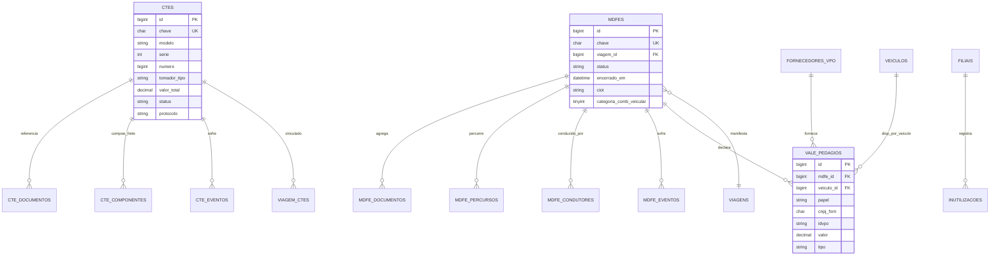

### 7.1 `ctes`

Campos de controle interno + campos fiscais. Os campos do XML que não têm uso em consulta ficam no `payload` JSON; os que aparecem em listagem, filtro ou relatório são colunas.

| Coluna | Tipo | Obrig. | Descrição |
|---|---|---|---|
| `empresa_id`, `filial_id` | bigint FK | ✔ | |
| `chave` | char(44) | | `unique(empresa_id, chave)`. Nula até a geração |
| `modelo` | string(2) | ✔ | `57` |
| `serie` | int | ✔ | |
| `numero` | bigint | ✔ | `unique(filial_id, modelo, serie, numero)` |
| `tipo_cte` | tinyint | ✔ | `0` normal, `1` complemento, `2` anulação, `3` substituto |
| `cte_referenciado_id` | bigint FK | | Para complemento/anulação/substituto |
| `tipo_servico` | tinyint | ✔ | `0` normal, `1` subcontratação, `2` redespacho, `3` redespacho intermediário, `4` serviço vinculado a multimodal |
| `modal` | string(2) | ✔ | `01` rodoviário (fase 1) |
| `cfop` | string(4) | ✔ | |
| `natureza_operacao` | string(60) | ✔ | |
| `emissao` | datetime | ✔ | |
| `municipio_envio_id` | bigint FK | ✔ | |
| `municipio_inicio_id`, `municipio_fim_id` | bigint FK | ✔ | Início e fim da prestação — código IBGE |
| `tomador_tipo` | tinyint | ✔ | `0` remetente, `1` expedidor, `2` recebedor, `3` destinatário, `4` outros — **RN-04** |
| `tomador_id`, `remetente_id`, `destinatario_id`, `expedidor_id`, `recebedor_id` | bigint FK `pessoas` | | |
| `ordem_coleta_id` | bigint FK | | Origem |
| `produto_predominante` | string(60) | ✔ | |
| `peso_bruto`, `peso_base_calculo`, `volumes` | decimal(15,4) | | |
| `valor_mercadoria` | decimal(15,2) | ✔ | Valor da carga |
| `valor_total_servico` | decimal(15,2) | ✔ | Valor do frete |
| `valor_receber` | decimal(15,2) | ✔ | |
| **ICMS** | | | |
| `icms_cst` | string(2) | ✔ | `00`, `20`, `40`, `41`, `51`, `60`, `90` |
| `icms_base`, `icms_aliquota`, `icms_valor` | decimal | | |
| **Reforma Tributária (NT 2026.002)** | | | |
| `ibs_cbs_payload` | json | | Grupo completo IBS/CBS |
| `cbs_base`, `cbs_aliquota`, `cbs_valor` | decimal | | |
| `ibs_uf_valor`, `ibs_mun_valor` | decimal | | |
| `p_dev_trib` | decimal(7,4) | | Percentual de devolução (cashback) |
| `pagamento_antecipado` | boolean | | Indicador do grupo de antecipação |
| **Transmissão** | | | |
| `status` | string(20) | ✔ | `rascunho` \| `assinado` \| `enviado` \| `autorizado` \| `rejeitado` \| `denegado` \| `cancelado` \| `contingencia` |
| `protocolo` | string(20) | | |
| `data_autorizacao` | datetime | | |
| `codigo_status`, `motivo_status` | string | | cStat/xMotivo |
| `tipo_emissao` | tinyint | ✔ | `1` normal, `4` EPEC, `5` FS-DA, `7` SVC-RS, `8` SVC-SP |
| `ambiente` | tinyint | ✔ | `1` produção, `2` homologação |
| `xml_path`, `pdf_path` | string | | |
| `payload` | json | ✔ | Estrutura completa usada na geração |
| `idempotency_key` | uuid | ✔ | RN-08 — `unique(empresa_id, idempotency_key)` |
| `created_by`, `updated_by` | bigint FK | ✔ | |

> **`payload` como fonte de verdade da montagem.** Guardar o JSON de entrada permite reemitir, auditar e depurar sem depender de reconstruir o objeto a partir de trinta colunas. O XML autorizado é a fonte de verdade **fiscal**; o payload é a fonte de verdade **da intenção**.

### 7.2 `cte_documentos`

Documentos da carga referenciados no CT-e.

`cte_id`, `tipo` (`nfe` \| `nf` \| `outros` \| `cte_anterior`), `chave` (char 44), `numero`, `serie`, `emissao`, `valor`, `peso`, `pin_suframa`, `data_prevista_entrega`.

### 7.3 `cte_componentes`

Composição do valor da prestação (`vTPrest` = soma dos componentes).

`cte_id`, `nome` (`FRETE PESO`, `FRETE VALOR`, `GRIS`, `AD VALOREM`, `PEDAGIO`, `TDE`, `TDA`, `TAXA ENTREGA`, `OUTROS`), `valor`, `ordem`.

### 7.4 `cte_eventos`

`cte_id`, `tipo_evento` (`110111` cancelamento, `110110` CC-e, `110113` EPEC, `110180` comprovante de entrega, `110181` cancelamento do comprovante, `610110` prestação em desacordo, `610111` cancelamento da prestação em desacordo), `sequencia`, `data_evento`, `justificativa`, `correcoes` (json), `protocolo`, `status`, `codigo_status`, `motivo_status`, `xml_path`, `created_by`.

`unique(cte_id, tipo_evento, sequencia)`.

### 7.5 `mdfes`

| Coluna | Tipo | Obrig. | Descrição |
|---|---|---|---|
| `empresa_id`, `filial_id` | bigint FK | ✔ | |
| `viagem_id` | bigint FK | ✔ | Um MDF-e por viagem/veículo |
| `chave` | char(44) | | `unique(empresa_id, chave)` |
| `modelo` | string(2) | ✔ | `58` |
| `serie`, `numero` | int/bigint | ✔ | |
| `modal` | string(2) | ✔ | `01` rodoviário |
| `tipo_emitente` | tinyint | ✔ | `1` prestador de serviço, `2` carga própria, `3` CT-e Globalizado — **determina exigência de CIOT (NT 2026.001)** |
| `tipo_transportador` | tinyint | | `1` ETC, `2` TAC, `3` CTC |
| `uf_inicio`, `uf_fim` | char(2) | ✔ | |
| `municipio_carregamento` | json | ✔ | Lista de municípios de carregamento |
| `emissao` | datetime | ✔ | |
| `veiculo_tracao_id` | bigint FK | ✔ | |
| `reboques` | json | | Placas, RENAVAM, tara, capacidade |
| `peso_bruto_total`, `valor_carga_total` | decimal | ✔ | |
| `unidade_peso` | tinyint | ✔ | `01` KG, `02` TON |
| `ciot` | string(12) | | Grupo `infCIOT` — obrigatório a partir de 23/11/2026 para `tpEmit` 1/2/3 rodoviário remunerado por terceiros |
| `ciot_cpf_cnpj` | string(14) | | Responsável pelo CIOT |
| `categoria_comb_veicular` | tinyint | | `categCombVeic` — 02 a 14, derivado do nº de eixos da composição. Obrigatório quando houver vale-pedágio (rejeição 731) |
| `contratante` | json | | CNPJ/CPF dos contratantes |
| `produto_perigoso` | boolean | | Dispara o grupo `peri` nos documentos vinculados |
| `lacres` | json | | |
| `seguro` | json | | Responsável, seguradora, apólice, averbação |
| `status` | string(20) | ✔ | `rascunho` \| `autorizado` \| `rejeitado` \| `cancelado` \| `encerrado` \| `contingencia` |
| `protocolo`, `data_autorizacao` | | | |
| `encerrado_em`, `municipio_encerramento_id` | | | **RN-03 — MDF-e aberto bloqueia novos** |
| `xml_path`, `pdf_path`, `payload`, `idempotency_key` | | | Como no CT-e |

### 7.6 `mdfe_documentos`

`mdfe_id`, `municipio_descarregamento_id`, `tipo` (`cte` \| `nfe`), `chave` (char 44), `cte_id` (FK interna quando próprio), `seg_codigo_barras`, `indicador_reentrega`, `peso`, `valor`.

### 7.7 `mdfe_percursos` e `mdfe_condutores`

`mdfe_percursos`: `mdfe_id`, `ordem`, `uf`.
`mdfe_condutores`: `mdfe_id`, `nome`, `cpf`, `motorista_id`.

### 7.8 `mdfe_eventos`

`mdfe_id`, `tipo_evento` (`110111` cancelamento, `110112` encerramento, `110114` inclusão de condutor, `110115` inclusão de DF-e, `110116` pagamento da operação de transporte, `110117` confirmação do serviço de transporte, `110118` alteração do pagamento do serviço de transporte, `310620` registro de passagem, `510620` registro de passagem automático), `sequencia`, `data_evento`, `payload`, `protocolo`, `status`, `xml_path`.

### 7.9 `vale_pedagios` — grupo `valePed` do MDF-e

> **Fase 1.** O vale-pedágio deixou de ser item do financeiro e virou requisito fiscal da Sprint 9, porque é grupo do próprio MDF-e. Ver `03_ESPECIFICACAO_FISCAL_CTE_MDFE.md`, seção 6.3.

**Um registro por veículo**, espelhando o subgrupo `disp` (1-N) do layout. A composição com cavalo e dois reboques que trafega com vale-pedágio gera três registros ligados ao mesmo MDF-e.

| Coluna | Tipo | Obrig. | Descrição |
|---|---|---|---|
| `empresa_id`, `filial_id` | bigint FK | ✔ | |
| `viagem_id` | bigint FK | ✔ | |
| `mdfe_id` | bigint FK | | Nulo enquanto o MDF-e não existe |
| `veiculo_id` | bigint FK | ✔ | Um `disp` por veículo |
| `papel` | string(10) | ✔ | `recebido` (a transportadora recebeu do embarcador) \| `fornecido` (a transportadora é embarcadora equiparada e forneceu ao subcontratado) |
| `fornecedor_vpo_id` | bigint FK | ✔ | → `fornecedores_vpo` |
| `cnpj_forn` | char(14) | ✔ | `CNPJForn` — denormalizado para o XML |
| `pagador_documento` | string(14) | ✔ | `CNPJPg` ou `CPFPg`, conforme o tipo |
| `pagador_tipo` | string(1) | ✔ | `J` → `CNPJPg`, `F` → `CPFPg` |
| `idvpo` | string(20) | ✔ | Vai na tag `nCompra`. **É o IDVPO**, não um número livre de comprovante |
| `valor` | decimal(15,2) | | `vValePed` |
| `tipo` | string(2) | ✔ | `tpValePed`: `01` TAG, `04` leitura de placa. `02` e `03` **descontinuados** — validar antes de transmitir |
| `data_aquisicao` | datetime | | |
| `comprovante_path` | string | | Prova do repasse — relevante quando `papel = fornecido` |
| `dispensado` | boolean | | Marca a viagem em que o VPO não se aplica |
| `motivo_dispensa` | string(40) | | `carga_propria` \| `sem_pedagio` \| `outro` |

Índices: `index(empresa_id, viagem_id)`, `index(mdfe_id)`, `unique(mdfe_id, veiculo_id)`.

> **Sobre `papel`:** a transportadora que subcontrata um autônomo vira embarcadora equiparada (Lei 10.209/2001, art. 1º, §3º, II) e passa a ser a **devedora** do vale-pedágio, sujeita a multa de R$ 3.000 por veículo/viagem e a indenização de 2× o frete. Modelar as duas pontas desde o início evita descobrir isso depois que o cliente tomar a multa.

### 7.10 `fornecedores_vpo`

Espelho local da lista de fornecedoras habilitadas pela ANTT — é o que valida `CNPJForn` antes de transmitir e evita a rejeição 733.

`cnpj` (char 14, UK — tabela global, **sem** `empresa_id`), `razao_social`, `ato_habilitacao`, `ativo`, `sincronizado_em`.

Alimentada por rotina que consome a "Relação de CNPJ de Fornecedores de Vale Pedágio" publicada no portal SVRS, com execução agendada. Validar localmente é mais rápido e produz mensagem melhor que esperar a rejeição da SEFAZ.

### 7.11 `inutilizacoes`

`filial_id`, `modelo`, `serie`, `numero_inicial`, `numero_final`, `ano`, `justificativa`, `protocolo`, `status`, `xml_path`, `created_by`.

### 7.12 `dfe_distribuicao`

Documentos baixados da SEFAZ (NF-e emitidas contra o CNPJ da transportadora, CT-e de terceiros).

`empresa_id`, `filial_id`, `nsu` (bigint), `max_nsu`, `tipo` (`nfe` \| `cte` \| `evento` \| `resumo`), `chave`, `emitente_cnpj`, `emitente_nome`, `valor`, `emissao`, `xml_path`, `manifestacao` (`pendente` \| `ciencia` \| `confirmada` \| `desconhecida` \| `nao_realizada`), `processado` (bool).

`unique(filial_id, nsu)`.

---

## 8. Financeiro

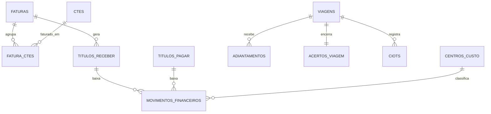

### 8.1 `faturas` e `fatura_ctes`

`faturas`: `empresa_id`, `filial_id`, `numero`, `cliente_id`, `emissao`, `vencimento`, `periodo_inicio`, `periodo_fim`, `valor_bruto`, `descontos`, `acrescimos`, `valor_liquido`, `status` (`aberta` \| `enviada` \| `paga` \| `parcial` \| `cancelada` \| `protestada`), `boleto_path`, `nosso_numero`, `pdf_path`.

`fatura_ctes`: `fatura_id`, `cte_id`, `valor`. `unique(cte_id)` — um CT-e só entra em uma fatura.

### 8.2 `titulos_receber` / `titulos_pagar`

Estrutura espelhada: `empresa_id`, `filial_id`, `pessoa_id`, `origem_type`/`origem_id` (fatura, OS, viagem, abastecimento), `numero`, `parcela`, `emissao`, `vencimento`, `valor`, `valor_pago`, `saldo`, `data_pagamento`, `forma_pagamento`, `centro_custo_id`, `plano_conta_id`, `status` (`aberto` \| `pago` \| `parcial` \| `cancelado` \| `vencido`), `observacoes`.

### 8.3 `adiantamentos` e `acertos_viagem`

`adiantamentos`: `empresa_id`, `viagem_id`, `motorista_id`, `data`, `valor`, `forma` (`dinheiro` \| `pix` \| `cartao_frota` \| `deposito`), `finalidade` (`pedagio` \| `combustivel` \| `alimentacao` \| `geral`), `titulo_pagar_id`, `observacoes`.

`acertos_viagem`: `viagem_id`, `data`, `total_adiantado`, `total_comprovado`, `total_glosado`, `saldo` (positivo = a receber do motorista), `comissao_valor`, `diarias_valor`, `valor_liquido`, `status` (`pendente` \| `conferido` \| `pago`), `conferido_por`, `observacoes`.

### 8.4 `ciots`

`empresa_id`, `viagem_id`, `mdfe_id`, `numero_ciot` (12), `tipo_viagem`, `contratante_documento`, `contratado_documento` (transportador autônomo), `instituicao_pagamento`, `valor_frete`, `valor_adiantamento`, `valor_quitacao`, `data_emissao`, `status` (`emitido` \| `pago` \| `cancelado`), `retorno` (json da instituição de pagamento).

### 8.5 Vale-pedágio — ver seção 7.9

A tabela `vale_pedagios` **migrou para o domínio fiscal** (seção 7.9), porque é grupo do próprio MDF-e e entrou na Fase 1. Do ponto de vista financeiro, o que importa é o que **não** deve acontecer:

- O valor do Vale-Pedágio Obrigatório **não** entra no valor do frete, **não** é receita operacional e **não** compõe base de ICMS, PIS/COFINS ou contribuições previdenciárias (Lei 10.209/2001, art. 2º). Não lance em `titulos_receber` como receita.
- Quando a transportadora é **embarcadora equiparada** (subcontratou um autônomo), o vale que ela compra é **custo da viagem** e gera título a pagar à fornecedora — esse sim entra no financeiro, com `viagem_id` preenchido para compor o custo por km.
- O pedágio **comum reembolsado** pelo tomador é outra coisa: entra como componente `PEDAGIO` do CT-e, é receita e compõe a base do ICMS.

### 8.6 `centros_custo` e `movimentos_financeiros`

`centros_custo`: `empresa_id`, `codigo`, `descricao`, `tipo` (`veiculo` \| `filial` \| `administrativo` \| `rota`), `referencia_id` (veículo/filial), `ativo`.

`movimentos_financeiros`: `empresa_id`, `filial_id`, `data`, `tipo` (`entrada` \| `saida`), `titulo_type`/`titulo_id`, `conta_bancaria_id`, `valor`, `centro_custo_id`, `plano_conta_id`, `viagem_id`, `veiculo_id`, `historico`.

> `viagem_id` e `veiculo_id` no movimento financeiro são o que permite o BI de custo por km sem reprocessar tudo.

---

## 9. Ordem sugerida de migrations

Respeitar dependências de chave estrangeira:

```
00  enums fiscais: tp_rod, tp_car, tp_carga, categ_comb_veic,
    tp_transp, tp_unid_transp, tp_unid_carga, cunid_cte, cunid_mdfe
01  ufs, paises, municipios, ncm, cfop                  (tabelas globais, seed)
01b classes_risco, grupos_compatibilidade, grupos_embalagem,
    produtos_perigosos, incompatibilidades, incompatibilidades_onu
02  empresas, filiais, usuarios, papeis, permissoes
03  certificados_digitais, sequencias_documento, parametros, auditorias
04  pessoas, pessoa_papeis, enderecos, contatos
05  naturezas_carga, carrocerias, cvc_configuracoes
05b unidades, mercadorias
06  tabelas_frete, tabela_frete_itens
07  veiculos, composicoes, composicao_itens
08  motoristas, contratos_agregacao, veiculo_documentos
09  pneus, pneu_movimentacoes
10  planos_manutencao, ordens_servico, os_itens
11  rotas, rota_pontos
12  ordens_coleta, oc_itens
13  viagens
14  ctes, cte_documentos, cte_componentes, cte_eventos
15  viagem_ctes                                          (depende de viagens + ctes)
16  mdfes, mdfe_documentos, mdfe_percursos, mdfe_condutores, mdfe_eventos
17  fornecedores_vpo (global, seed + sync), vale_pedagios
18  inutilizacoes, dfe_distribuicao
19  abastecimentos, despesas_viagem                      (depende de viagens)
20  ocorrencias, entregas
21  centros_custo, plano_contas, contas_bancarias
22  faturas, fatura_ctes, titulos_receber, titulos_pagar
23  adiantamentos, acertos_viagem, ciots
24  movimentos_financeiros
```

---

## 10. Máquinas de estado

Documentar as transições evita status inventado no meio do desenvolvimento.

### CT-e

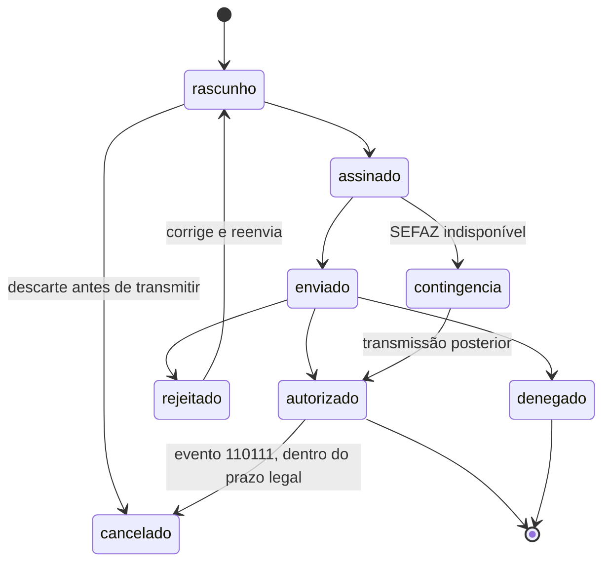

### MDF-e

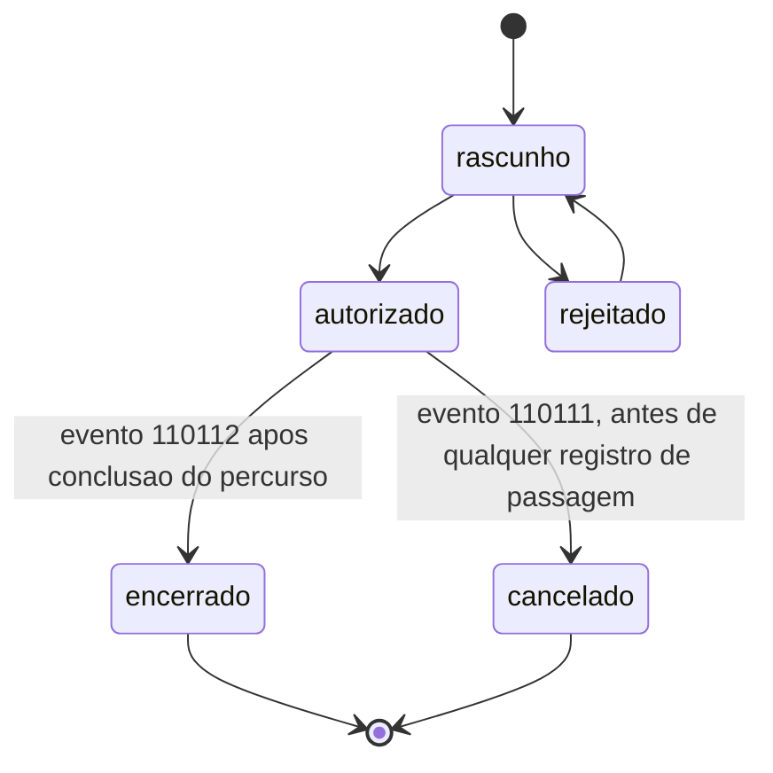

### Viagem

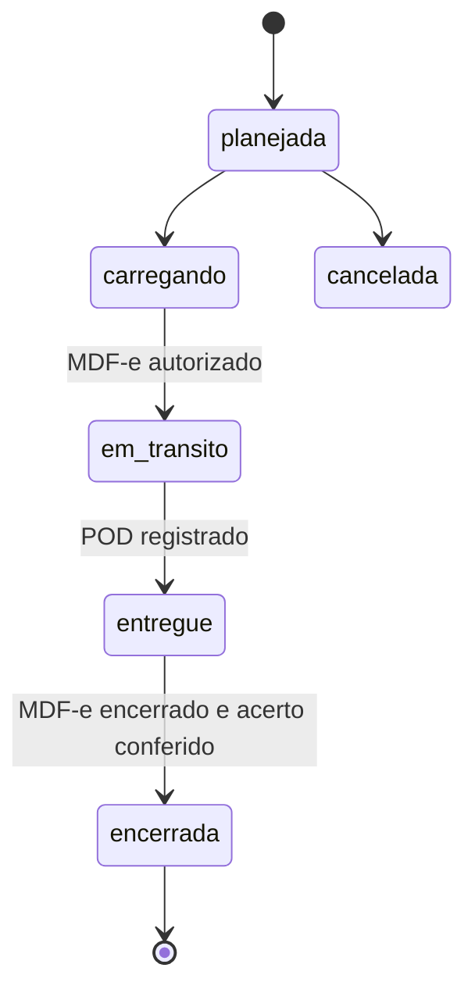

---

## 11. Índices críticos de performance

Definidos a partir das consultas que o sistema fará com mais frequência.

```php
// Painel de operação — a tela mais acessada
$table->index(['empresa_id', 'status', 'saida_prevista'], 'idx_viagens_painel');

// Busca de documento fiscal por chave
$table->unique(['empresa_id', 'chave'], 'uk_ctes_chave');

// Numeração
$table->unique(['filial_id', 'modelo', 'serie', 'numero'], 'uk_ctes_numeracao');

// Painel de vencimentos
$table->index(['empresa_id', 'vencimento', 'bloqueia_operacao'], 'idx_doc_vencimento');

// Média de consumo por veículo
$table->index(['veiculo_id', 'data_hora'], 'idx_abast_veiculo');

// Faturamento — CT-e pendente de fatura
$table->index(['empresa_id', 'status', 'tomador_id', 'emissao'], 'idx_ctes_faturamento');

// Distribuição DF-e — controle de NSU
$table->unique(['filial_id', 'nsu'], 'uk_dfe_nsu');

// Financeiro — contas a vencer
$table->index(['empresa_id', 'status', 'vencimento'], 'idx_titulos_vencimento');
```

---

## 12. Pontos de atenção da modelagem

| # | Ponto | Por quê |
|---|---|---|
| 1 | `viagem_ctes` é N:N e não pode virar `cte.viagem_id` | RN-02. Carga fracionada e transbordo quebram o 1:1 |
| 2 | Reboque é registro em `veiculos`, não coluna na tração | Reboque troca de cavalo; tem documento, tara e capacidade próprios |
| 3 | `composicao_snapshot` na viagem, em JSON | A composição do dia não pode ser reescrita quando o cadastro mudar |
| 4 | `pessoas` unificada com papéis | Um cliente também pode ser remetente, destinatário e proprietário de veículo |
| 5 | `ie_indicador` obrigatório em `pessoas` | Rejeição SEFAZ recorrente por indicador de IE errado |
| 6 | Grupos IBS/CBS previstos desde já | NT 2026.002 em produção a partir de 31/08/2026 |
| 7 | `payload` JSON ao lado das colunas | Layout fiscal muda; colunas não acompanham na mesma velocidade |
| 8 | Custos denormalizados na viagem + job de reconciliação | Performance do painel; débito técnico assumido e documentado |
| 9 | Sem `deleted_at` em tabela fiscal | Documento fiscal não se apaga |
| 10 | `municipios` com IBGE completo, carregado no seed | CT-e não emite sem código IBGE correto |
| 11 | `vale_pedagios` é **um registro por veículo**, não por viagem | Espelha o subgrupo `disp` (1-N) do MDF-e; composição com reboques gera vários |
| 12 | `vale_pedagios.papel` distingue recebido × fornecido | A transportadora que subcontrata autônomo vira embarcadora equiparada e passa a **dever** o vale |
| 13 | `veiculos.eixos` obrigatório | Sem ele não há `categCombVeic` — rejeição 731 |
| 14 | `fornecedores_vpo` é tabela **global**, sincronizada da ANTT/SVRS | Valida `CNPJForn` localmente e evita a rejeição 733 |
| 15 | CNPJ como `string(14)`, nunca inteiro | NT Conjunta 2025.001 torna o CNPJ alfanumérico |
| 16 | Enum fiscal e tabela operacional são separados | O fisco tem 6 carrocerias; a transportadora usa 19. Tanque e silo não têm código próprio |
| 17 | `tpCarga` é **derivado** de natureza + flag perigosa | Os códigos 07 a 11 são as versões perigosas de 01 a 05. Armazenar os 12 soltos gera inconsistência |
| 18 | Sem `jornada` nem `registro_ponto` para agregado e autônomo | Modelar jornada de TAC é produzir prova de vínculo empregatício contra o próprio cliente |
| 19 | `fator_cubagem_kg_m3` é parâmetro em cascata, não constante | Não existe norma que fixe o fator; é livre pactuação por cliente e rota |
| 20 | `grupo peri` existe no MDF-e, **não** no CT-e rodoviário | No CT-e o grupo só existe no modal aéreo |
