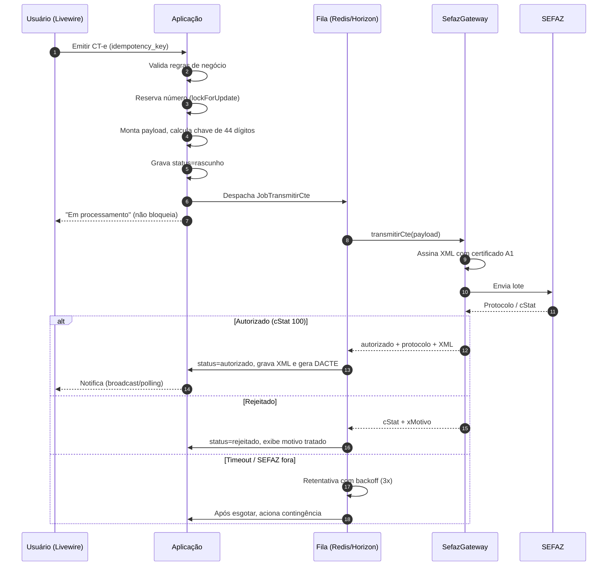
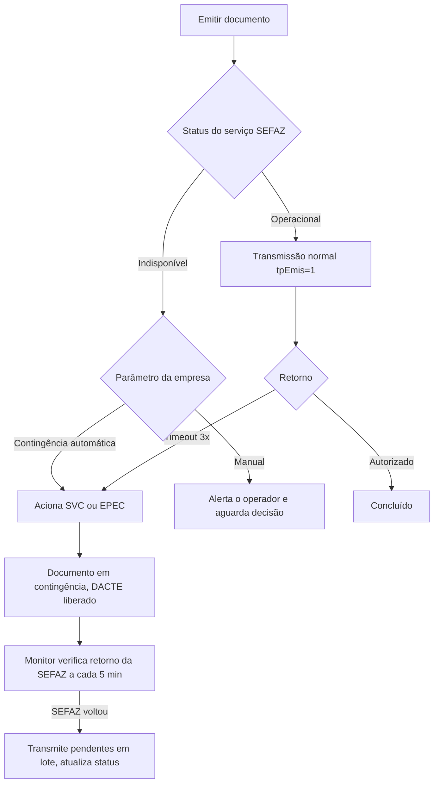

# PetroWeb Frota — Especificação Fiscal: CT-e e MDF-e

> Layouts, fluxo SEFAZ, eventos, contingência, decisão de biblioteca e plano de homologação.
> Documento complementar a `01_DOCUMENTO_MESTRE.md`. Versão 1.3 — 21/08/2026.

> ⚠️ **Aviso de vigência.** Este documento retrata o cenário de **agosto de 2026**, período de transição da Reforma Tributária do Consumo. Notas técnicas e Atos Técnicos alteram prazos com frequência. **Antes de iniciar a implementação, baixe a versão vigente do MOC e dos schemas XSD nos portais oficiais e confirme os prazos da seção 4.** Nenhum blog — inclusive as fontes citadas ao final — substitui o portal.

---

## 1. Universo de documentos

| Documento | Modelo | Uso | Fase |
|---|---|---|---|
| **CT-e** — Conhecimento de Transporte Eletrônico | 57 | Transporte de cargas. O documento fiscal do frete | **1** |
| **MDF-e** — Manifesto Eletrônico de Documentos Fiscais | 58 | Agrega os DF-e embarcados em um veículo/viagem | **1** |
| **CT-e OS** — CT-e Outros Serviços | 67 | Transporte de pessoas, valores e excesso de bagagem | 4 |
| **CT-e Simplificado** | 57 | Variante simplificada, também alcançada pela NT 2026.002 | 4 |
| **GTV-e** — Guia de Transporte de Valores eletrônica | 64 | Transporte de valores | 4 |
| **DACTE / DAMDFE** | — | Representações gráficas em PDF | **1** |
| **Distribuição DF-e** | — | Download de NF-e/CT-e emitidos contra o CNPJ | 2 |

A fase 1 cobre **modal rodoviário** apenas (`modal = 01`). Aéreo, aquaviário, ferroviário e dutoviário existem no layout e não serão implementados.

---

## 2. Decisão estratégica: biblioteca própria ou API de terceiros

Esta é a decisão de maior impacto do projeto e precisa ser tomada **antes** da Sprint fiscal.

### 2.1 O contexto que muda a conta

Historicamente, transportadoras brasileiras usavam a biblioteca open source `nfephp-org/sped-cte` e `sped-mdfe` e ficavam bem servidas. O cenário de 2026 é outro: a Reforma Tributária está reescrevendo os layouts de todos os DF-e em etapas, com prazos móveis.

**Verificação feita em 21/08/2026:** o `sped-cte` teve seu último release em **v5.0.1, de 06/06/2025** (Packagist), sem nenhuma versão posterior. O README ainda documenta o leiaute **3.00a**. Existe a **issue #374, aberta em 07/07/2026**, pedindo publicação de versão com suporte à Reforma Tributária (IBS/CBS) — **sem release até esta data**.

Traduzindo para risco de projeto: **construir sobre a biblioteca aberta hoje significa apostar que ela acompanhará prazos regulatórios que já escorregaram uma vez** — a produção da Etapa 1 da NT 2026.002 saiu de 03/08/2026 para "implementação futura" na v1.01 da própria nota.

### 2.2 As três opções

| | **A. Biblioteca própria (sped-cte / sped-mdfe)** | **B. API comercial** | **C. Híbrido** |
|---|---|---|---|
| Custo inicial | Alto (4-8 semanas de dev fiscal) | Baixo (1-2 semanas de integração) | Médio |
| Custo recorrente | Zero de licença; alto de manutenção | Por documento ou mensalidade | Por documento |
| Risco de layout | **Assumido integralmente pela HALC** | Transferido ao fornecedor | Transferido na fase 1 |
| Time-to-market | Lento | Rápido | Rápido |
| Controle | Total | Dependência de fornecedor | Total no longo prazo |
| Margem no SaaS | Melhor em escala | Custo variável por cliente | Melhor em escala |
| Contingência/EPEC | Você implementa | Geralmente incluída | Fornecedor na fase 1 |

### 2.3 Recomendação

**Opção C — híbrido, com API comercial na fase 1.**

O raciocínio: o valor que o PetroWeb Frota entrega ao cliente **não está** na emissão do CT-e. Está no ciclo fechado de custo, na viagem, no MDF-e que nasce sozinho, no painel de vencimentos. Emissão fiscal é infraestrutura commodity — e é justamente a parte que mais muda por força de lei. Gastar as primeiras 8 semanas do projeto brigando com schema XSD enquanto o diferencial competitivo espera é má alocação de esforço, especialmente com a RTC em movimento.

A trava que torna isso seguro: **`SefazGatewayInterface`**. Toda a aplicação fala com essa interface, nunca com o fornecedor. Se em 18 meses a economia de escala justificar internalizar, troca-se a implementação sem tocar em nenhuma tela, nenhuma regra de negócio e nenhum job.

```php
interface SefazGatewayInterface
{
    public function transmitirCte(CtePayload $payload): ResultadoTransmissao;
    public function consultarPorChave(string $chave, string $modelo): ResultadoConsulta;
    public function cancelar(string $chave, string $justificativa, string $protocolo): ResultadoEvento;
    public function cartaCorrecao(string $chave, array $correcoes, int $sequencia): ResultadoEvento;
    public function transmitirMdfe(MdfePayload $payload): ResultadoTransmissao;
    public function encerrarMdfe(EncerramentoMdfe $dados): ResultadoEvento;
    public function inutilizar(FaixaInutilizacao $faixa): ResultadoEvento;
    public function statusServico(string $uf, int $ambiente): ResultadoStatus;
    public function distribuicaoDFe(string $cnpj, int $ultimoNsu): ResultadoDistribuicao;
}
```

Implementações: `ApiComercialGateway` (fase 1) e `SpedNativoGateway` (avaliação na fase 3+). Ambas retornam os mesmos DTOs. Um `FakeGateway` serve os testes automatizados — **nenhum teste de CI toca a SEFAZ**.

### 2.4 Critérios para escolher o fornecedor

Ao avaliar provedores (Focus NFe, TecnoSpeed/PlugNotas, Nuvem Fiscal, eNotas e similares), pontuar em:

1. **CT-e modelo 57 e MDF-e modelo 58 completos** — muitos provedores fortes em NF-e e NFS-e são fracos em CT-e. Verificar explicitamente.
2. **Suporte à NT 2026.002 já publicado** (grupos IBS/CBS) — pedir evidência, não promessa.
3. **Eventos completos:** cancelamento, CC-e, EPEC, encerramento de MDF-e, inclusão de DF-e, comprovante de entrega.
4. **Contingência** — EPEC e FS-DA tratados pelo provedor.
5. **Distribuição DF-e** disponível.
6. **DACTE e DAMDFE em PDF** gerados pela API (economiza semanas de layout).
7. **Modelo de preço compatível com SaaS multi-tenant** — por documento, com repasse viável ao plano do cliente.
8. **Webhooks** de retorno assíncrono, não só polling.
9. **Ambiente de homologação estável e documentado.**
10. **SLA e suporte técnico em português com canal de escalonamento.**

> **Providência recomendada:** solicitar proposta e acesso de teste a **três** fornecedores antes da Sprint 7, e emitir um CT-e real em homologação com cada um. A decisão sai do teste, não do site.

---

## 3. Fluxo SEFAZ

### 3.1 Ambientes

| Ambiente | `tpAmb` | Uso |
|---|---|---|
| Homologação | `2` | Desenvolvimento e testes. Documento **sem valor fiscal**. Razão social do destinatário deve ser a frase de teste padrão |
| Produção | `1` | Documento com valor fiscal |

O ambiente é atributo **da filial**, não global. Uma empresa pode ter filial em homologação enquanto outra já opera.

### 3.2 Autorizadoras

O CT-e é autorizado pela SEFAZ da UF do emitente, exceto nas UFs que delegam:

- **SVRS** (Sefaz Virtual do Rio Grande do Sul) — autorizadora de várias UFs e das contingências SVC-RS.
- **SVSP** (Sefaz Virtual de São Paulo) — contingência SVC-SP.

O sistema mantém uma tabela de endpoints por UF, modelo, ambiente e serviço, versionada em arquivo de configuração — **não** hardcoded em classe. Quando se usa API comercial, isso fica com o fornecedor, mas a tabela continua útil para consulta de status e para o cenário de internalização futura.

### 3.3 Ciclo de emissão do CT-e



**Regras que sustentam esse fluxo (RN-07 e RN-08 do documento mestre):**

- Nenhuma chamada externa dentro do request HTTP.
- Antes de transmitir, o job **consulta a chave na SEFAZ**. Se já estiver autorizada, apenas registra — não reenvia. É isso que impede documento duplicado por retentativa.
- `idempotency_key` (UUID) gerado na tela e único por empresa. Duplo clique reaproveita o registro existente.
- Retentativa: 3 tentativas, backoff `60s → 300s → 900s`. Depois, o documento vai para tratamento manual ou contingência automática, conforme parâmetro da empresa.

### 3.4 Rejeições mais frequentes e tratamento

O sistema deve traduzir `cStat` em mensagem acionável em português, não exibir o retorno bruto.

| cStat | Motivo | Tratamento no PetroWeb Frota |
|---|---|---|
| 100 | Autorizado | Sucesso |
| 204 | Duplicidade de CT-e | Consultar a chave e vincular ao registro existente — **não** reemitir |
| 217 | CT-e não consta na base | Chave inexistente; verificar geração |
| 226 | UF do emitente diverge da autorizadora | Erro de configuração de filial |
| 236 | Chave de acesso com dígito verificador inválido | Bug de geração de chave — nunca deve chegar ao usuário |
| 301/302 | Irregularidade fiscal do emitente/destinatário | Bloqueio cadastral; orientar o usuário a regularizar |
| 402/404 | Divergência de valores | Recalcular componentes do frete |
| 539 | Duplicidade de chave com diferença de dados | Número queimado; inutilizar e reemitir |
| 613/614 | Chave de NF-e referenciada inválida | Validar as chaves capturadas na ordem de coleta |
| 684 | **Ausência do CIOT no MDF-e** | Obrigatória a partir de 23/11/2026 (ver seção 4.2) |
| 999 | Erro não catalogado | Log completo + alerta ao suporte |

Manter uma tabela `sefaz_status` com `codigo`, `descricao_oficial`, `mensagem_usuario`, `acao_sugerida` e `categoria` (`cadastro` \| `calculo` \| `sistema` \| `sefaz`). A qualidade dessa tabela é o que separa um emissor tolerável de um emissor bom.

---

## 4. Notas técnicas que atravessam o projeto

### 4.1 CT-e, CT-e OS e GTV-e — NT 2026.002

Introduz os grupos de IBS/CBS e campos correlatos:

| Campo/grupo | Finalidade |
|---|---|
| Grupo IBS/CBS | Tributos da Reforma. **Obrigatório para emitente em Regime Normal** |
| `pDevTrib` | Percentual de devolução de tributos (mecanismo de cashback) |
| `ISUFEmit` | Inscrição SUFRAMA do emitente — exigida em operações em Área de Livre Comércio com alíquota zero de CBS |
| Grupo de pagamento antecipado | Indicador e dados de pagamentos realizados antecipadamente |

**Validações que a SEFAZ passa a aplicar:** presença obrigatória do grupo IBS/CBS para Regime Normal; alíquota de CBS de **0,90%** no período de transição; validação da inscrição SUFRAMA; consistência das referências de pagamento antecipado.

A NT 2026.002 v1.00 foi publicada em 11/06/2026 e alcança CT-e, CT-e OS, **CT-e Simplificado** e GTV-e. O grupo `ISUFEmit` fica dentro de `gALCZFMCBS`, sob `gCBS`. O indicador de antecipação distingue tipo `1` (pagamento antecipado) de tipo `3` (fornecimento com pagamento realizado anteriormente, exigindo a chave de acesso do DF-e do pagamento).

**Cronograma (confirmar no portal antes de programar):**

| Etapa | Homologação | Produção |
|---|---|---|
| Etapa 1 — campos RTC obrigatórios | 01/07/2026 | Era 03/08/2026 na v1.00; a **v1.01** (publicada no início de agosto/2026) mudou para **"implementação futura"**, sem nova data |
| Etapa 2 — demais alterações | 03/08/2026 | **31/08/2026** |

> ⚠️ **Divergência entre fontes sobre o ato normativo.** Fontes de mercado atribuem o adiamento a um "Ato Técnico Conjunto RFB/CGIBS nº 1, de 31/07/2026". Já o **Ato Conjunto RFB/CGIBS nº 4, de 30/07/2026**, que fixa o cronograma geral dos DF-e da RTC, mantém 03/08/2026 para CT-e, CT-e OS, GTV-e e MDF-e. **A referência normativa exata deve ser confirmada no PDF da v1.01 da NT no portal oficial** — não assuma a data a partir de blog.

**Alíquotas-teste de 2026 (LC 214/2025):** CBS **0,9%** e IBS **0,1%**. A SEFAZ valida esses percentuais automaticamente.

**Consequência para o PetroWeb Frota:** as colunas e o JSON de IBS/CBS entram na modelagem do CT-e desde a primeira migration (já previstos em `02_MODELAGEM_DADOS.md`, seção 7.1). O cálculo tributário fica em uma classe dedicada (`Domain/Fiscal/CalculoTributario`) com estratégia por regime (`Simples`, `RegimeNormal`) e por vigência, porque haverá convivência de regras durante toda a transição.

### 4.2 MDF-e — NT 2026.001 (CIOT obrigatório)

Publicada em 29/05/2026, com base no Ajuste SINIEF 03/2026. Torna obrigatório o preenchimento do grupo `infCIOT` no MDF-e para transporte rodoviário de cargas por conta de terceiros. **Não há alteração de layout nem novo pacote de schemas** — o grupo já existia e passa de opcional a obrigatório. Rejeição associada: **684 — "CIOT deverá ser informado"**.

| Homologação | Produção |
|---|---|
| 21/09/2026 | **23/11/2026** |

**Condição por tipo de emitente:**

| `tpEmit` | Descrição | Exigência do CIOT |
|---|---|---|
| 1 | Prestador de serviço de transporte | Direta |
| 2 | Transportador de carga própria | **Condicionada** — depende de a operação ser remunerada por conta de terceiros, sinalizada por `tpTransp` |
| 3 | Prestador que emitirá CT-e Globalizado | Direta |

> A regra do `tpEmit = 2` é a que mais confunde. Implemente a validação lendo `tpTransp`, não presumindo obrigatoriedade incondicional — bloquear indevidamente a emissão de carga própria é tão ruim quanto tomar a rejeição 684.

**Consequência para o PetroWeb Frota:** o módulo de CIOT deixa de ser "desejável" e vira requisito de produção com data. Ele foi antecipado para a Sprint 12 no backlog. Como o CIOT é gerado por instituição de pagamento de frete homologada pela ANTT, a integração com uma dessas instituições precisa ser contratada e testada com antecedência — não é código que se escreve na véspera.

---

### 4.3 MDF-e — NT 2025.001 (já em produção, é a linha de base)

Diferente das duas anteriores, esta **já está valendo** — produção desde **06/10/2025** (versão v1.03 de 21/08/2025). Não é um prazo futuro a acompanhar: é o mínimo que o sistema precisa atender no dia 1.

O que ela mudou e que importa para nós:

| Mudança | Impacto |
|---|---|
| `tpValePed` — enum restrito a `01` (TAG) e `04` (leitura de placa); `02` e `03` descontinuados | Ver seção 6.3.6 |
| `nCompra` redefinido como **IDVPO** | Não é mais número de comprovante genérico |
| Preparação para **CNPJ alfanumérico** | Ver seção 5.2 |
| Códigos de status de 3 ou 4 dígitos | O parser de retorno não pode assumir 3 dígitos |
| Novo tipo de componente de frete; campos de CIOT opcionais | |

**Novas rejeições criadas por ela**, todas ligadas a carga lotação e TAC:

| Rejeição | Assunto |
|---|---|
| 301 | NCM do produto predominante obrigatório |
| 302 | Grupo de informações de pagamento obrigatório |
| 303 | Dados bancários / pagamento do TAC com RNTRC |
| 304 | CIOT obrigatório para TAC |

> A rejeição **304** merece atenção: o CIOT já é exigido para TAC desde outubro/2025 por esta NT. A NT 2026.001 (seção 4.2) **amplia** a exigência, não a cria. Ou seja, o módulo de CIOT tem um pé em produção **agora**, não só em novembro — outro motivo para não deixá-lo por último.

---

## 5. CT-e — estrutura e regras

### 5.1 Grupos principais do XML (modal rodoviário)

```
infCte
├─ ide          Identificação: cUF, cCT, CFOP, natOp, mod, serie, nCT, dhEmi,
│               tpImp, tpEmis, cDV, tpAmb, tpCTe, procEmi, verProc,
│               cMunEnv, modal, tpServ, cMunIni, cMunFim, retira, indIEToma
│               └─ toma3/toma4  ← DEFINE O TOMADOR (RN-04)
├─ compl        Informações complementares, observações, fluxo
├─ emit         Emitente: CNPJ, IE, xNome, enderEmit, CRT
├─ rem          Remetente
├─ exped        Expedidor (opcional)
├─ receb        Recebedor (opcional)
├─ dest         Destinatário
├─ vPrest       Valores: vTPrest, vRec
│  └─ Comp[]    Componentes: FRETE PESO, FRETE VALOR, GRIS, PEDAGIO, ...
├─ imp          Impostos
│  ├─ ICMS      CST 00/20/40/41/51/60/90 + partilha e ST
│  └─ [IBS/CBS] ← NT 2026.002
├─ infCTeNorm
│  ├─ infCarga  vCarga, proPred, xOutCat, infQ[] (quantidades por unidade)
│  ├─ infDoc    infNFe[] / infNF[] / infOutros[]  ← chaves da carga
│  ├─ docAnt    Documentos anteriores (redespacho/subcontratação)
│  ├─ infModal  └─ rodo: RNTRC, occ (ordens de coleta)
│  ├─ veicNovos Quando transporta veículos zero-km
│  ├─ cobr      Fatura e duplicatas
│  └─ infGlobalizado / infServVinc
├─ infCteComp   Quando tpCTe = 1 (complemento)
├─ infCteAnu    Quando tpCTe = 2 (anulação)
└─ autXML[]     CNPJ/CPF autorizados a baixar o XML (contador, cliente)
```

### 5.2 Chave de acesso (44 dígitos)

```
cUF(2) + AAMM(4) + CNPJ(14) + mod(2) + serie(3) + nCT(9) + tpEmis(1) + cCT(8) + cDV(1)
```

- `cCT` é o código numérico aleatório de 8 dígitos — **não** pode ser igual ao número do CT-e.
- `cDV` é dígito verificador módulo 11 sobre os 43 dígitos anteriores.
- A estrutura é idêntica para NF-e, CT-e e MDF-e.
- A geração da chave tem teste unitário obrigatório com casos conhecidos. Erro aqui gera rejeição 236 e é embaraçoso.

> ⚠️ **CNPJ alfanumérico.** A NT Conjunta 2025.001 torna as 14 posições do CNPJ **alfanuméricas**. Isso altera a rotina de cálculo do dígito verificador da chave de acesso e a validação de CNPJ em todo o sistema — não é só o módulo fiscal: atinge o cadastro de pessoas, a filial e qualquer máscara de tela. Trate o CNPJ como `string(14)` desde a primeira migration (já assim na modelagem) e implemente o DV suportando letras. Verifique o cronograma vigente dessa NT no portal.

### 5.3 Tomador do serviço — o campo que mais causa problema

| `toma` | Quem é | Consequência |
|---|---|---|
| 0 | Remetente | Fatura vai para o remetente |
| 1 | Expedidor | |
| 2 | Recebedor | |
| 3 | Destinatário | Frete FOB — quem recebe paga |
| 4 | Outros | Exige o grupo `toma4` com CNPJ/CPF, IE e endereço completos |

Regras que o PetroWeb Frota deve aplicar **antes** de transmitir:

- `indIEToma` (contribuinte / isento / não contribuinte) precisa bater com o cadastro do tomador. É origem de rejeição recorrente.
- Se `toma = 4`, o grupo `toma4` é obrigatório e completo.
- O tomador determina o destinatário da fatura no módulo financeiro — a integração é automática, não uma escolha na tela de faturamento.

### 5.4 Tipos de CT-e e de serviço

| `tpCTe` | Significado | Regra |
|---|---|---|
| 0 | Normal | |
| 1 | Complemento de valores | Exige `infCteComp` com a chave do CT-e complementado |
| 2 | Anulação | Usado quando o tomador não é contribuinte; exige `infCteAnu` |
| 3 | Substituto | Substitui CT-e anulado |

| `tpServ` | Significado |
|---|---|
| 0 | Normal |
| 1 | Subcontratação |
| 2 | Redespacho |
| 3 | Redespacho intermediário |
| 4 | Serviço vinculado a multimodal |

Os tipos 1 a 3 exigem o grupo `docAnt` com os documentos anteriores — é aqui que a modelagem N:N de `viagem_ctes` (RN-02) prova seu valor.

### 5.5 Composição do valor da prestação

`vTPrest` **deve** ser igual à soma exata dos componentes em `Comp[]`. Divergência gera rejeição.

| Componente | Base típica |
|---|---|
| FRETE PESO | Por kg ou por tonelada, com valor mínimo |
| FRETE VALOR | Percentual sobre o valor da mercadoria |
| GRIS | Gerenciamento de risco — percentual sobre o valor da carga |
| AD VALOREM | Percentual sobre o valor da carga |
| PEDAGIO | Pedágio comum reembolsado — **não** o Vale-Pedágio Obrigatório (ver 5.6) |
| TDE / TDA | Taxa de dificuldade de entrega / de acesso |
| TAXA ENTREGA | Fixa |
| OUTROS | Livre |

O cálculo vem de `tabelas_frete` + `tabela_frete_itens`. O arredondamento é definido uma vez, na classe de cálculo (`round` a 2 casas, half-up), e usado em todo lugar — divergência de centavo entre a tela e o XML é bug clássico.

> ⚠️ **`xNome` é texto livre (1 a 15 caracteres), não código de tabela oficial.** "PEDAGIO", "GRIS" e os demais nomes acima são convenção de mercado, não enum do layout. Padronize os nomes em uma constante da aplicação para que os relatórios e o faturamento consigam agrupar por componente — se cada operador digitar o que quiser, o BI da Fase 3 não fecha.

### 5.6 Pedágio no CT-e — a distinção que evita erro fiscal

Este ponto é fonte recorrente de erro e merece estar explícito.

**O grupo `valePed` não existe no CT-e.** Ele existia no layout 2.00 e foi **removido no CT-e 3.00**, permanecendo removido no 4.00 — hoje o grupo `rodo` do CT-e contém apenas `RNTRC` e `occ` (ordens de coleta). O Vale-Pedágio Obrigatório é informado no **MDF-e**, no grupo `infANTT/valePed` (seção 6.3).

| Modalidade | Onde vai | Integra o valor do frete? | Integra a base do ICMS? |
|---|---|---|---|
| **Vale-Pedágio Obrigatório** (Lei 10.209/2001) | Grupo `valePed` do **MDF-e** | **Não** | **Não** |
| **Pedágio comum reembolsado** pelo tomador | Componente `PEDAGIO` em `vPrest/Comp` do CT-e | Sim | **Sim** |

O fundamento da primeira linha é o art. 2º da Lei 10.209/2001, em texto literal: o valor do Vale-Pedágio *"não integra o valor do frete, não será considerado receita operacional ou rendimento tributável, nem constituirá base de incidência de contribuições sociais ou previdenciárias"*. Já o pedágio simplesmente reembolsado pelo tomador é importância recebida a título de ressarcimento e **compõe** a base do ICMS do serviço de transporte.

> **Regra para o sistema:** ao lançar pedágio, o operador escolhe entre "Vale-pedágio obrigatório" e "Pedágio reembolsado". A escolha decide se o valor vai ao `valePed` do MDF-e (fora do frete) ou ao componente `PEDAGIO` do CT-e (dentro do frete e da base de ICMS). Deixar isso a critério da digitação livre produz erro de tributação — a tela precisa forçar a distinção.

> **Nota prospectiva.** O art. 2º, parágrafo único da Lei 10.209/2001, na redação da Lei 14.206/2021, determina que o valor do VPO seja destacado em campo específico do **DT-e (Documento Eletrônico de Transporte)**. Ou seja, a lei já aponta para um documento futuro. Enquanto o DT-e não substitui a sistemática atual, o campo operacional é o `valePed` do MDF-e.

### 5.7 Produto perigoso no CT-e — não existe no rodoviário

> ⚠️ **O modal rodoviário do CT-e não tem grupo `peri`.** O grupo existe no CT-e apenas em `infCTeNorm/aereo/peri`, com composição própria (`nONU`, `qTotEmb`, `infTotAP`). O grupo `rodo` do CT-e contém somente `RNTRC` e `occ`.
>
> No transporte rodoviário, quem carrega a informação estruturada de produto perigoso é o **MDF-e** (seção 6.5). No CT-e, o produto perigoso aparece na **descrição textual** exigida pelo capítulo 5.4 do Anexo da Res. ANTT 5.998/2022, montada automaticamente pelo sistema a partir do cadastro:
>
> ```
> ONU 1098, ÁLCOOL ALÍLICO, Subclasse 6.1, (Classe 3), GE I, 1000 kg
> ```
>
> Detalhamento completo em `05_CADASTROS_E_TABELAS_DE_DOMINIO.md`, seções 8.4 e 8.7.

### 5.8 Unidades de medida do CT-e

O grupo `infQ` de `infCarga` usa `cUnid` com **6 valores**: `00` M3, `01` KG, `02` TON, `03` UNIDADE, `04` LITROS, `05` MMBTU.

> ⚠️ **O MDF-e usa uma tabela diferente**, com apenas `01` KG e `02` TON. São enums distintos — não compartilhe a tabela de domínio nem a tela.

`tpMed` é string livre de 1 a 20 caracteres. Padronize os valores em constante da aplicação (`PESO BRUTO`, `PESO DECLARADO`, `PESO CUBADO`, `PESO BASE DE CÁLCULO`, `LITRAGEM`, `CAIXAS`) — digitação livre inviabiliza qualquer relatório de peso.

O **peso taxável** — `MAX(peso real, peso cubado)` — é o que alimenta `qCarga` com `tpMed = "PESO BASE DE CÁLCULO"`. O fator de cubagem é parâmetro por cliente e rota, não constante: ver doc. 05, seção 10.3. Vale acompanhar.

---

## 6. MDF-e — estrutura e regras

### 6.1 Grupos principais

```
infMDFe
├─ ide          cUF, tpAmb, tpEmit, tpTransp, mod, serie, nMDF, cMDF, cDV,
│               modal, dhEmi, tpEmis, procEmi, verProc, UFIni, UFFim,
│               infMunCarrega[], infPercurso[], dhIniViagem,
│               indCanalVerde, indCarregaPosterior
├─ emit         Emitente
├─ infModal
│  └─ rodo      ├─ infANTT ├─ RNTRC
│               │          ├─ infCIOT[]        ← NT 2026.001 (obrigatório 23/11/2026)
│               │          ├─ valePed         ← VPO: disp[] por veículo + categCombVeic
│               │          ├─ infContratante[]
│               │          └─ infPag[]         ← pagamento do frete
│               ├─ veicTracao  cInt, placa, RENAVAM, tara, capKG, capM3,
│               │              prop (quando terceiro), condutor[], tpRod, tpCar, UF
│               ├─ veicReboque[]  (até 3)
│               ├─ codAgPorto
│               └─ lacRodo[]
├─ infDoc
│  └─ infMunDescarga[]
│     ├─ infCTe[]   chave, SegCodBarra, indReentrega, infUnidTransp
│     └─ infNFe[]   (carga própria)
├─ seg[]        Seguro: responsável, seguradora, apólice, averbação
├─ prodPred     Produto predominante + infLotacao (origem/destino)
├─ tot          qCTe, qNFe, vCarga, cUnid, qCarga
├─ lacres[]
├─ autXML[]
└─ infAdic
```

### 6.2 Regras operacionais

| Regra | Detalhe |
|---|---|
| Um MDF-e por veículo por viagem | Composição com 3 reboques = 1 MDF-e, não 4 |
| Emissão antes da saída | O MDF-e precisa estar autorizado antes de o veículo iniciar o percurso |
| Encerramento obrigatório | Evento `110112`, informando data, UF e município de encerramento. **RN-03** |
| MDF-e aberto trava a operação | A SEFAZ acusa manifestos não encerrados e isso vira pendência fiscal. O PetroWeb Frota deve exibir painel de "MDF-e em aberto" com alerta por tempo decorrido |
| Inclusão de DF-e após emissão | Evento `110115`, apenas para carregamento posterior (`indCarregaPosterior`) |
| Inclusão de condutor | Evento `110114` — troca de motorista em rota |
| Cancelamento | Evento `110111`, só antes de qualquer registro de passagem |
| Operação interestadual | `infPercurso[]` com as UFs atravessadas, na ordem |
| Produto perigoso | Grupo `peri` com ONU, classe de risco, grupo de embalagem e quantidade. **Fica dentro de `infCTe` e `infNFe`, sob `infMunDescarga`** — não é grupo de cabeçalho |

### 6.3 Vale-Pedágio Obrigatório (VPO) — **requisito de Fase 1**

O vale-pedágio não é um detalhe do financeiro: é uma **obrigação legal com campo próprio no MDF-e**, e a transportadora cliente do PetroWeb Frota é frequentemente a devedora, não a credora. Por isso ele foi antecipado da Fase 2 para a **Sprint 9, junto do MDF-e**.

#### 6.3.1 Base legal vigente

| Item | Situação em 08/2026 |
|---|---|
| Lei | **Lei 10.209/2001**, com alterações das Leis 10.561/2002, 14.206/2021 e 14.229/2021 |
| Regulamento | **Resolução ANTT nº 6.024/2023** (vigente desde 01/09/2023), alterada pela Resolução nº 6.044/2024 |
| Norma revogada | Resolução ANTT nº 2.885/2008 — **revogada**. Documentação e blogs que a citam estão desatualizados |

#### 6.3.2 Quem paga — e por que isso importa para o nosso cliente

O responsável pelo pagamento antecipado é o **embarcador**, definido como o proprietário originário da carga (art. 1º, §1º e §2º). Mas o §3º **equipara a embarcador**:

1. o contratante do serviço de transporte que **não** é o proprietário da carga (agenciador, operador logístico);
2. **a empresa transportadora que subcontratar transportador autônomo (TAC)**.

> ⚠️ **Esta é a regra que muda o desenho do produto.** A hipótese 2 significa que a transportadora — nosso cliente — **vira embarcadora equiparada sempre que subcontrata um autônomo**. Ela não é só quem recebe o vale-pedágio: é quem tem de comprá-lo e repassá-lo, sob multa. O PetroWeb Frota precisa, portanto, tratar o VPO nas **duas pontas**: o vale que a transportadora recebe do seu cliente e o vale que ela precisa fornecer ao agregado ou autônomo que subcontrata.

O repasse deve ocorrer **até o momento do embarque** e **não pode ser feito em espécie**.

#### 6.3.3 Penalidades

| Quem | Infração | Penalidade |
|---|---|---|
| Contratante / embarcador equiparado | Não adquirir e repassar o VPO | **R$ 3.000,00 por veículo, por viagem** (Res. 6.024/2023) |
| Embarcador | Infração à Lei 10.209 | **Indenização ao transportador de 2× o valor do frete** (art. 8º). É pena civil, cumulativa com a multa administrativa. Prescreve em 12 meses da realização do transporte |
| Fornecedora (FVPO) | Não repassar o valor ao transportador | R$ 5.000,00 por operação |
| Concessionária de rodovia | Recusar modelo aprovado | R$ 5.000,00 por dia |

> **Sobre o valor de R$ 550 que circula na internet:** é o regime **revogado** (Res. 2.885/2008), ainda presente em FAQ legada da ANTT e replicado por blogs. O art. 3º, §7º da Lei 10.209 também prevê R$ 550 de multa diária, mas dirigida às **concessionárias**, nunca ao embarcador. Não use esse número.

#### 6.3.4 Apenas meios eletrônicos desde 31/01/2025

A Res. 6.024/2023 exige modelos com pagamento automatizado. Cupom e cartão físico deixaram de ser aceitos em **31/01/2025** (emitidos até 31/12/2024, válidos por mais 30 dias). Meios válidos hoje: **TAG eletrônica** e **leitura de placa (OCR)**, compatível com free flow.

Desde **23/04/2025** a ANTT opera o sistema aprimorado de geração do VPO, que emite um **IDVPO** (identificador único por vale) e valida na emissão: transportador ativo no RNTRC, veículo registrado no RNTRC e veículo pertencente à frota cadastrada do transportador.

> **Consequência de produto:** o RNTRC do transportador e o cadastro do veículo na ANTT precisam estar corretos **antes** da compra do vale, ou a emissão falha. Isso conecta o VPO ao painel de vencimentos (RN-09) — RNTRC vencido não é só uma pendência de cadastro, é bloqueio de operação.

#### 6.3.5 Fornecedoras (FVPO)

A ANTT mantém **lista pública de fornecedoras habilitadas** (cerca de 16 empresas), e o portal SVRS publica a *"Relação de CNPJ de Fornecedores de Vale Pedágio"* — é essa lista que valida o campo `CNPJForn` e gera a rejeição 733.

A maioria das FVPO são **instituições de pagamento** que também emitem CIOT. Contratar **um único fornecedor para VPO + CIOT + pagamento eletrônico de frete** é o padrão de mercado e a recomendação para o projeto: reduz uma integração inteira. Isso **não funde** as obrigações — cada uma tem seu fato gerador e sua multa.

#### 6.3.6 O grupo `valePed` no MDF-e

```
rodo
└── infANTT
    ├── RNTRC
    ├── infCIOT      (0-N)
    ├── valePed      (0-1)
    │   ├── disp     (1-N)  ← um por veículo
    │   │   ├── CNPJForn    CNPJ da fornecedora (deve constar da lista ANTT/SVRS)
    │   │   ├── CNPJPg      CNPJ do responsável pelo pagamento   ┐ choice
    │   │   ├── CPFPg       CPF do responsável pelo pagamento    ┘
    │   │   ├── nCompra     ← redefinido como IDVPO (por veículo)
    │   │   ├── vValePed    Valor
    │   │   └── tpValePed   Tipo
    │   └── categCombVeic   Categoria de combinação veicular (02 a 14)
    ├── infContratante (0-N)
    └── infPag
```

| Campo | Tipo | Obrig. | Observação |
|---|---|---|---|
| `CNPJForn` | N 14 | ✔ | Validado contra a base da ANTT |
| `CNPJPg` / `CPFPg` | N 14 / N 11 | choice | Responsável pelo pagamento (embarcador ou equiparado) |
| `nCompra` | C 1-20 | ✔ | **É o IDVPO** desde a NT 2025.001 — não é mais "número do comprovante de compra" genérico |
| `vValePed` | N 15v2 | | |
| `tpValePed` | N 2 | | Ver tabela abaixo |
| `categCombVeic` | N 2 | | Valores **02 a 14** (veículo comercial de 2 a 10+ eixos) |

**`tpValePed` — atenção, o enum mudou:**

| Valor | Significado | Situação |
|---|---|---|
| `01` | TAG | **Válido** |
| `02` | Cupom | **Descontinuado** pela NT 2025.001 |
| `03` | Cartão | **Descontinuado** pela NT 2025.001 |
| `04` | Leitura de placa | **Válido** — criado pela NT 2025.001 |

> ⚠️ Como a restrição é de **enum no XSD**, enviar `02` ou `03` não gera rejeição específica de vale-pedágio: falha na **validação de schema**, com erro genérico. Isso é confuso em produção — o PetroWeb Frota deve validar o enum **antes** de transmitir e explicar o motivo ao operador.

**Rejeições do grupo (NT 2021.001):**

| Código | Mensagem |
|---|---|
| 731 | A categoria de combinação veicular deve ser preenchida para o grupo vale pedágio |
| 732 | CNPJ do fornecedor do vale-pedágio inválido |
| 733 | CNPJ do fornecedor não existe na base da ANTT |
| 734 | CPF/CNPJ do responsável pelo pagamento inválido |

#### 6.3.7 Dispensas

| Situação | Exigência |
|---|---|
| **Carga própria** (`tpEmit = 2`) em veículo/frota do proprietário da carga | **Dispensado** — não há embarcador distinto do transportador |
| Percurso **sem praça de pedágio** | Sem fato gerador. Por isso `valePed` é grupo opcional (0-1) |
| `tpEmit = 2` **com `tpTransp` informado** | ⚠️ **A dispensa não se sustenta** — é operação por conta de terceiros. A NT 2026.001 já trata esse caso como sujeito ao CIOT |
| Veículo vazio, carga fracionada, transporte internacional | Constam de FAQ **legada** da ANTT (que cita a resolução revogada). **Confirmar no articulado da Res. 6.024/2023 antes de parametrizar o sistema** |

#### 6.3.8 O que o PetroWeb Frota precisa fazer

1. Cadastrar as FVPO habilitadas com CNPJ, sincronizando a lista do SVRS para validar `CNPJForn` localmente e evitar a rejeição 733.
2. Registrar o VPO **recebido** do cliente embarcador (com IDVPO, fornecedora, valor e tipo) na viagem.
3. Registrar o VPO **fornecido** ao subcontratado quando a transportadora for embarcadora equiparada — com prova do repasse, porque a multa é dela.
4. Levar os dados ao grupo `valePed` do MDF-e, **um `disp` por veículo** da composição.
5. Calcular e informar `categCombVeic` a partir do número de eixos da composição — dado que precisa existir no cadastro de veículos.
6. Bloquear a emissão com `tpValePed` descontinuado, com mensagem explicativa.
7. Alertar quando a viagem percorrer rota com pedágio e não houver VPO registrado, respeitando as dispensas.
8. Manter o valor do VPO **fora** do valor do frete e fora da base de cálculo do ICMS (ver 5.6).

### 6.4 CIOT — o que precisa estar pronto até 23/11/2026

O CIOT é gerado por **instituição de pagamento de frete homologada pela ANTT**, não pelo sistema. O PetroWeb Frota precisa:

1. Contratar/integrar uma instituição de pagamento (avaliar as opções de mercado — decisão comercial, com prazo).
2. Cadastrar contratante e contratado (transportador autônomo/TAC) com os dados exigidos.
3. Solicitar a geração do CIOT ao emitir a viagem com frete de terceiros.
4. Levar o número ao grupo `infCIOT` do MDF-e.
5. Registrar o pagamento e a quitação, com retorno gravado em `ciots.retorno`.

Verificação de `tpEmit`: quando `1`, `2` ou `3` e modal rodoviário com remuneração por conta de terceiros, o grupo é obrigatório sob pena da rejeição 684.

---

### 6.5 Produto perigoso no MDF-e — grupo `peri`

Ocorre em três pontos da estrutura, sempre com a mesma composição interna: dentro de `infCTe` e de `infNFe` (ambos sob `infMunDescarga`) e dentro de `infMDFeTransp` (aquaviário). **Não é grupo de cabeçalho** — é por documento vinculado.

| Tag | Descrição | Tipo | Ocorr. | Tam. |
|---|---|---|---|---|
| `peri` | Grupo — quando há produto classificado pela ONU como perigoso | grupo | 0-n | — |
| `nONU` | Número ONU | string | **1-1 obrigatório** | **4** |
| `xNomeAE` | Nome apropriado para embarque | string | 0-1 | 1-150 |
| `xClaRisco` | Classe/subclasse **e risco subsidiário** | string | 0-1 | 1-40 |
| `grEmb` | Grupo de embalagem | string | 0-1 | 1-6 |
| `qTotProd` | Quantidade total por produto | **string** | **1-1 obrigatório** | 1-20 |
| `qVolTipo` | Quantidade e tipo de volumes | **string** | 0-1 | 1-60 |

Três detalhes que economizam retrabalho:

1. `qTotProd` e `qVolTipo` são **strings**, não numéricos — a unidade vai no próprio texto (`"5000 L"`, `"1 TANQUE"`). Formate no sistema; não deixe digitação livre.
2. `nONU` tem exatamente 4 posições — **grave com zeros à esquerda** (`0004`, `1203`).
3. `xClaRisco` concentra classe e risco subsidiário no mesmo campo: `"6.1 (3)"`, `"3 (8)"`, `"1.4S"`.

> **Tags que não existem**, apesar de aparecerem em documentação de terceiros: `pontoFulgor` e `qTotGed`. O ponto de fulgor é atributo de cadastro (FISPQ), usado para derivar o grupo de embalagem da Classe 3, e **não é transmitido**.

Classes de risco, grupos de embalagem, quantidade limitada e a Relação de Produtos Perigosos estão em `05_CADASTROS_E_TABELAS_DE_DOMINIO.md`, seção 8.

### 6.6 Unidades de transporte e de carga

`infUnidTransp` (a unidade que se move) contém `infUnidCarga` (o que vai dentro), ambos com N ocorrências, lacres opcionais e quantidade rateada.

**`tpUnidTransp`:** `1` Rodoviário Tração · `2` Rodoviário Reboque · `3` Navio · `4` Balsa · `5` Aeronave · `6` Vagão · `7` Outros.

**`tpUnidCarga`:** `1` Container · `2` ULD · `3` Pallet · `4` Outros.

---

## 7. Eventos

| Código | Documento | Evento | Prazo / condição |
|---|---|---|---|
| 110111 | CT-e / MDF-e | Cancelamento | CT-e: prazo legal contado da autorização (usualmente 168h — **confirmar na legislação vigente da UF**). Exige justificativa de 15 a 255 caracteres e ausência de circulação da mercadoria |
| 110110 | CT-e | Carta de Correção Eletrônica | Não corrige valores, datas de emissão, CNPJ do emitente/tomador, nem dados que alterem o cálculo do imposto |
| 110113 | CT-e | EPEC — Evento Prévio de Emissão em Contingência | Quando a SEFAZ está indisponível |
| 110160 | CT-e | Registros do Multimodal | **Não confundir com comprovante de entrega** |
| **110180** | CT-e | **Comprovante de entrega eletrônico** | Substitui o canhoto físico. Criado pela NT 2019.001 do CT-e |
| **110181** | CT-e | Cancelamento do comprovante de entrega | |
| 610110 | CT-e | Prestação de serviço em desacordo | Registrado pelo tomador |
| 610111 | CT-e | Cancelamento da prestação em desacordo | |
| 110112 | MDF-e | **Encerramento** | Obrigatório após conclusão do percurso |
| 110114 | MDF-e | Inclusão de condutor | |
| 110115 | MDF-e | Inclusão de DF-e | Só com `indCarregaPosterior` |
| 110116 | MDF-e | Pagamento da operação de transporte | |
| 110117 | MDF-e | Confirmação do serviço de transporte | Criado pela NT 2022.001 do MDF-e |
| **110118** | MDF-e | **Alteração do pagamento do serviço de transporte** | Criado pela NT 2022.001 do MDF-e |
| 310620 | MDF-e | Registro de passagem | Gerado pelo fisco, recebido pelo sistema |
| 510620 | MDF-e | Registro de passagem automático | |

> ⚠️ **Armadilha verificada.** É comum a documentação de terceiros trocar `110160` (Registros do Multimodal) por `110180` (comprovante de entrega) e `110116` (pagamento da operação) por `110118` (alteração do pagamento). Os códigos acima foram conferidos contra o MOC do CT-e e do MDF-e. Confirme no MOC vigente antes de implementar — errar o código do evento gera rejeição e retrabalho.

**Implementação:** cada evento é um job com o mesmo tratamento de retentativa e idempotência da emissão. O XML de retorno é armazenado com o mesmo rigor do XML do documento — evento é documento fiscal.

**Sequência:** eventos do mesmo tipo no mesmo documento são numerados sequencialmente (`nSeqEvento`). A CC-e é o caso comum de sequência > 1. O controle da sequência é do sistema, não do usuário.

---

## 8. Contingência

Quando a SEFAZ está indisponível, o veículo não pode parar.

| Modo | `tpEmis` | Quando |
|---|---|---|
| Normal | 1 | Operação padrão |
| Contingência offline | 2 | |
| Regime Especial NFF | 3 | Nota Fiscal Fácil |
| **EPEC** | 4 | SEFAZ da UF fora; registra o evento prévio e transmite o CT-e depois |
| **FS-DA** | 5 | Formulário de Segurança — impressão em papel específico |
| **SVC-RS** | 7 | Sefaz Virtual de Contingência RS |
| **SVC-SP** | 8 | Sefaz Virtual de Contingência SP |

### Fluxo automático no PetroWeb Frota



**Requisitos:**

- Monitor de status do serviço SEFAZ por UF, executado a cada 5 minutos, com resultado em cache. A tela de emissão consulta o cache, não a SEFAZ.
- Fila dedicada de reprocessamento de contingência, separada da fila normal.
- Painel de "documentos em contingência" visível e com contador — contingência esquecida vira problema fiscal.
- Registro de auditoria do momento de entrada e saída da contingência, com o motivo.

---

## 9. DACTE e DAMDFE

| Requisito | Detalhe |
|---|---|
| Formato | PDF, A4 retrato (DACTE) — layout definido no MOC |
| Código de barras | CODE-128C com a chave de 44 dígitos |
| QR Code | Obrigatório no DAMDFE; verificar exigência vigente no DACTE |
| Marca d'água | "SEM VALOR FISCAL" em ambiente de homologação — **obrigatório** |
| Contingência | Identificação visível do modo e do motivo |
| Logo | Da filial emitente |
| Envio | Por e-mail ao tomador, com XML anexo, no momento da autorização |
| Armazenamento | Junto ao XML, mesmo particionamento por tenant |

Se a API comercial já entrega o PDF pronto, usar. Layout de DACTE é trabalho detalhista e sem valor competitivo.

---

## 10. Certificado digital

| Item | Definição |
|---|---|
| Tipo | **A1** (arquivo `.pfx`) — A3 exige token físico e é inviável em servidor |
| Armazenamento | Storage privado, fora do webroot, particionado por tenant |
| Senha | Criptografada com a chave da aplicação. **Nunca** em texto puro, nunca em log, nunca em variável de ambiente por tenant |
| Validação no upload | CNPJ do titular deve bater com o da filial; validade deve ser futura |
| Alerta | D-30, D-15, D-7 e no dia — e-mail e painel |
| Bloqueio | Certificado vencido bloqueia emissão com mensagem clara, não com erro genérico de assinatura |
| Rotação | Upload de novo certificado sem downtime; o antigo fica no histórico |

---

## 11. Guarda de documentos

| Requisito | Definição |
|---|---|
| Prazo legal | **Ver nota abaixo.** Adotar 11 anos (132 meses) como política do produto |
| O que guardar | XML autorizado, XML de todos os eventos, protocolos, PDF do DACTE/DAMDFE |
| Estrutura | `empresa/{empresa_id}/{modelo}/{ano}/{mes}/{chave}.xml` |
| Backup | Diário, com retenção e teste de restauração periódico |
| Exportação | Download em lote por período — o contador vai pedir todo mês. **Não é feature opcional** |
| Integridade | Hash SHA-256 do XML gravado em coluna, verificado na exportação |

> ⚠️ **Sobre o prazo de guarda — há divergência entre fontes.** A referência tradicional é de **5 anos** (prazo decadencial, CTN arts. 173 e 174), e na prática a contagem do art. 173 costuma estender a retenção efetiva para cerca de 6 anos. O **Ajuste SINIEF nº 2/2025**, com efeitos desde 01/05/2025, fixou **132 meses (11 anos)** contados da autorização. As fontes divergem sobre quem é o destinatário dessa obrigação: a leitura majoritária — incluindo resposta a consulta da SEFAZ/SP — é de que os 132 meses se aplicam às **administrações tributárias**, permanecendo o contribuinte com 5 anos; parte da doutrina entende que alcança também o contribuinte.
>
> **Decisão para o PetroWeb Frota:** armazenar por **11 anos**. Armazenamento de XML é barato; discussão com o fisco não é. A política de retenção fica parametrizável por empresa, com 132 meses como padrão, e o custo de storage entra na precificação do plano.

---

## 12. Plano de homologação

### 12.1 Pré-requisitos

- [ ] Certificado A1 de teste (ou o de produção, apontando para `tpAmb = 2`)
- [ ] Filial configurada em ambiente de homologação
- [ ] Tabela de municípios IBGE completa carregada
- [ ] CNPJ/IE de teste válidos para a UF
- [ ] Contrato ou trial ativo com o provedor escolhido
- [ ] Schemas XSD da versão vigente baixados do portal oficial

### 12.2 Roteiro de testes (cada item vira caso de teste automatizado com gateway fake, e teste manual com a SEFAZ)

**CT-e**

1. Emissão normal, tomador = remetente, contribuinte
2. Emissão com tomador = destinatário (frete FOB)
3. Emissão com tomador = outros (`toma4` completo)
4. Emissão com tomador não contribuinte (`indIEToma = 9`)
5. Emissão com múltiplas NF-e referenciadas
6. Emissão interestadual com partilha de ICMS
7. Emissão por emitente do Simples Nacional (CRT 1)
8. Emissão por emitente do Regime Normal **com grupos IBS/CBS** (NT 2026.002)
9. CT-e complementar
10. CT-e de anulação e substituto
11. Subcontratação com `docAnt`
12. Redespacho
13. Cancelamento dentro do prazo
14. Cancelamento fora do prazo (deve ser recusado com mensagem clara)
15. Carta de Correção — campo permitido
16. Carta de Correção — campo proibido (deve ser bloqueado pelo sistema antes de transmitir)
17. Comprovante de entrega eletrônico
18. Rejeição proposital (IE inválida) e tratamento da mensagem
19. Inutilização de faixa de numeração
20. Contingência EPEC e transmissão posterior

**MDF-e**

21. Emissão com 1 CT-e
22. Emissão com N CT-e e múltiplos municípios de descarga
23. Emissão com composição (cavalo + 2 reboques)
24. Emissão de carga própria (`tpEmit = 2`, referenciando NF-e)
25. **Emissão com `infCIOT`** (NT 2026.001)
26. **Emissão com `valePed`** — um `disp` por veículo, `tpValePed = 01` (TAG), `nCompra` com IDVPO válido
27. Emissão com `valePed` e `tpValePed = 04` (leitura de placa)
28. Emissão com `tpValePed = 02` (cupom) → o sistema deve **bloquear antes de transmitir**, com mensagem explicando que o tipo foi descontinuado
29. Emissão com `CNPJForn` fora da lista da ANTT → rejeição 733 tratada com mensagem clara
30. Emissão sem `categCombVeic` no grupo de vale-pedágio → rejeição 731 tratada
31. Emissão com composição de 3 veículos e um `disp` para cada
32. Emissão de carga própria em rota com pedágio, sem `valePed` (deve ser aceita — dispensa)
33. Emissão com produto perigoso — grupo `peri` dentro de `infCTe`, com `nONU` de 4 posições e `xClaRisco` incluindo risco subsidiário
34. Percurso interestadual com `infPercurso`
35. Encerramento
36. Inclusão de condutor
37. Inclusão de DF-e com carregamento posterior
38. Cancelamento
39. Tentativa de emitir com MDF-e anterior em aberto (deve alertar)

**Transversais**

40. Idempotência: 50 requisições simultâneas de emissão do mesmo documento → 1 documento
41. Numeração: 50 emissões concorrentes → sem duplicidade e sem salto
42. Isolamento multi-tenant: empresa A não acessa documento da empresa B por ID direto
43. Certificado vencido → bloqueio com mensagem específica
44. SEFAZ fora → contingência automática e recuperação
45. Exportação de XML do mês em lote
46. Verificação de hash de integridade do XML armazenado
47. Sincronização da lista de CNPJ de fornecedoras de vale-pedágio do SVRS

### 12.3 Critério de saída da homologação

Os 47 casos acima executados com sucesso em ambiente de homologação, com evidência arquivada (XML e protocolo), e os casos 40 a 47 cobertos por teste automatizado no CI.

---

## 13. Estrutura de código sugerida

```
app/
├─ Domain/Fiscal/
│  ├─ Cte/
│  │  ├─ CtePayload.php            DTO de entrada
│  │  ├─ ChaveAcesso.php           Geração e validação do DV
│  │  ├─ CalculoTributario/
│  │  │  ├─ EstrategiaSimples.php
│  │  │  ├─ EstrategiaRegimeNormal.php
│  │  │  └─ CalculoIbsCbs.php      NT 2026.002
│  │  └─ Regras/                   Validações pré-transmissão
│  ├─ Mdfe/
│  │  ├─ MdfePayload.php
│  │  ├─ MontadorPorViagem.php     Viagem → MDF-e sem digitação
│  │  └─ Regras/
│  └─ Eventos/
├─ Services/Fiscal/
│  ├─ CteService.php
│  ├─ MdfeService.php
│  ├─ NumeracaoService.php         lockForUpdate
│  ├─ ContingenciaService.php
│  └─ Sefaz/
│     ├─ SefazGatewayInterface.php
│     ├─ ApiComercialGateway.php
│     ├─ SpedNativoGateway.php     (fase 3+)
│     ├─ FakeGateway.php           (testes)
│     └─ Dto/
├─ Jobs/Fiscal/
│  ├─ TransmitirCte.php
│  ├─ TransmitirMdfe.php
│  ├─ ProcessarEvento.php
│  ├─ EncerrarMdfe.php
│  ├─ MonitorarStatusSefaz.php
│  ├─ ReprocessarContingencia.php
│  └─ BaixarDistribuicaoDFe.php
└─ Support/Sefaz/
   ├─ StatusRetorno.php            Tradução de cStat
   └─ EndpointsPorUf.php
```

---

## 14. Checklist antes da primeira linha de código fiscal

- [ ] Baixar MOC vigente do CT-e e do MDF-e nos portais oficiais
- [ ] Baixar os schemas XSD vigentes e versioná-los no repositório em diretório próprio
- [ ] Verificar se houve novo Ato Técnico alterando os prazos da NT 2026.002 (Etapa 2, produção 31/08/2026)
- [ ] Confirmar o prazo da NT 2026.001 (CIOT, produção 23/11/2026)
- [ ] Testar emissão em homologação com **três** provedores candidatos
- [ ] Decidir o provedor com base no teste e nos 10 critérios da seção 2.4
- [ ] Definir a tabela `sefaz_status` com as rejeições mais comuns já traduzidas
- [ ] Escrever o teste da chave de acesso antes de escrever o gerador
- [ ] Confirmar prazo legal de cancelamento de CT-e na legislação da UF dos primeiros clientes
- [ ] Conferir no MOC os códigos de evento antes de codificá-los (110180/110181 e 110118 são os erros mais comuns em documentação de terceiros)
- [ ] Verificar o cronograma vigente da NT Conjunta 2025.001 (CNPJ alfanumérico) e ajustar a rotina de DV da chave de acesso
- [ ] Definir a política de retenção de XML (padrão do produto: 132 meses)
- [ ] Baixar a "Relação de CNPJ de Fornecedores de Vale Pedágio" no portal SVRS e criar a rotina de sincronização
- [ ] Confirmar no articulado da Res. ANTT 6.024/2023 quais dispensas de vale-pedágio permanecem válidas (a FAQ da ANTT ainda cita a resolução revogada)
- [ ] Verificar se a MDF-e NT 2025.001 está integralmente atendida pelo provedor escolhido — ela já está em produção desde 06/10/2025

---

## 15. Fontes consultadas

- [NT 2026.002 — CT-e, CTe-OS e GTV-e: evoluções para a Reforma Tributária do Consumo (TecnoSpeed)](https://blog.tecnospeed.com.br/nt-2026-002-reforma-tributaria-ct-e/)
- [Nota Técnica Reforma Tributária CT-e — visão geral (TecnoSpeed)](https://blog.tecnospeed.com.br/nota-tecnica-reforma-tributaria-ct-e/)
- [NT 2026.001 — Exigência do CIOT no MDF-e (TecnoSpeed)](https://blog.tecnospeed.com.br/nota-tecnica-2026-001-exigencia-do-ciot-no-mdfe/)
- [Portal Nacional do CT-e — Schemas XML](https://www.cte.fazenda.gov.br/portal/listaConteudo.aspx?tipoConteudo=0xlG1bdBass%3D)
- [Portal Nacional do CT-e — Notas técnicas](https://www.cte.fazenda.gov.br/portal/listaConteudo.aspx?tipoConteudo=Y0nErnoZpsg%3D)
- [Portal DF-e SVRS — Documentos do CT-e](https://dfe-portal.svrs.rs.gov.br/Cte/Documentos)
- [Portal DF-e SVRS — Documentos do MDF-e](https://dfe-portal.svrs.rs.gov.br/mdfe/Documentos)
- [MOC CT-e — Relação dos tipos de evento](https://www.cte.fazenda.gov.br/portal/exibirArquivo.aspx?conteudo=JqK0S8XBtRQ%3D)
- [NT 2019.001 do CT-e — Comprovante de entrega (110180/110181)](https://www.cte.fazenda.gov.br/portal/exibirArquivo.aspx?conteudo=8EkgHcpFoPE%3D)
- [MOC MDF-e — Visão geral e eventos](https://www.cte.fazenda.gov.br/portal/exibirArquivo.aspx?conteudo=QWruTo%2FrvI8%3D)
- [NT 2022.001 do MDF-e — Grupo de pagamento e novos eventos (TecnoSpeed)](https://blog.tecnospeed.com.br/mdf-e-nota-tecnica-2022-001-adequacao-do-grupo-pagamento-novos-eventos-novo-tipo-de-autorizador-e-ajustes-nas-rv/)
- [Schema oficial `cteTiposBasico_v3.00.xsd` (SVRS)](https://dfe-portal.svrs.rs.gov.br/Schemas/PRCTE/cteTiposBasico_v3.00.xsd)
- [NT Conjunta 2025.001 — CNPJ alfanumérico](https://www.cte.fazenda.gov.br/portal/exibirArquivo.aspx?conteudo=cxpT6%2F6wST8%3D)
- [Ato Conjunto RFB/CGIBS nº 4/2026 — cronograma dos DF-e (Systax)](https://www.systax.com.br/artigos-e-novidades/cronograma-dos-documentos-fiscais-e-definido-e-prazo-de-03-08-2026-e-mantido-para-documentos-estrategicos/)
- [Ajuste SINIEF nº 2/2025 — prazo de guarda de 132 meses (Klaus Fiscal)](https://klausfiscal.com.br/blog/novo-prazo-de-guarda-de-xml-entenda-o-que-muda-e-o-que-nao-muda-com-o-ajuste-sinief-no-2-2025)
- [SEFAZ/SP — Resposta à Consulta 31869/2025 (alcance do prazo de guarda)](https://legislacao.fazenda.sp.gov.br/Paginas/RC31869_2025.aspx)
- [nfephp-org/sped-cte no GitHub — releases](https://github.com/nfephp-org/sped-cte/releases)
- [nfephp-org/sped-cte — issue #374 (suporte a IBS/CBS)](https://github.com/nfephp-org/sped-cte/issues)
- [Lei 10.209/2001 — Vale-Pedágio Obrigatório (Planalto)](https://www.planalto.gov.br/ccivil_03/leis/leis_2001/l10209.htm)
- [ANTT — O que é o Vale-Pedágio Obrigatório](https://www.gov.br/antt/pt-br/assuntos/cargas/vale-pedagio-obrigatorio/o-que-e)
- [ANTT — Fornecedoras de VPO habilitadas (lista pública)](https://www.gov.br/antt/pt-br/assuntos/cargas/vale-pedagio-obrigatorio/fornecedores-de-vpo-habilitadas)
- [ANTT — Resolução nº 6.024/2023 (ANTTlegis)](https://anttlegis.antt.gov.br/action/ActionDatalegis.php?acao=abrirTextoAto&tipo=RES&numeroAto=00006024&seqAto=000&valorAno=2023&orgao=DG/ANTT/MT&codTipo=&desItem=&desItemFim=&cod_menu=5408&cod_modulo=161&pesquisa=true)
- [ANTT — Sistema de geração do VPO aprimorado, com IDVPO (23/04/2025)](https://www.gov.br/antt/pt-br/assuntos/ultimas-noticias/vale-pedagio-obrigatorio-eletronico-inicia-operacao-em-23-04-2025)
- [ANTT — Fim dos meios físicos de pagamento do VPO](https://www.gov.br/antt/pt-br/assuntos/ultimas-noticias/antt-moderniza-pagamento-do-vale-pedagio-obrigatorio-a-partir-de-2025)
- [NT 2021.001 do MDF-e — criação do grupo `disp` e de `tpValePed` (PDF)](https://inventti.com.br/wp-content/uploads/2021/01/MDFe_Nota_Tecnica_2021_001.pdf)
- [NT 2025.001 do MDF-e — alterações de schema e validação (TecnoSpeed)](https://blog.tecnospeed.com.br/nota-tecnica-mdfe-2025-001/)
- [Guia MDFe_Util — grupo `infANTT` e dispositivo de vale-pedágio](https://flexdocs.net/guiaMDFe/gerarMDFe.modal.rodo.infANTT.html)
- [VRI Consulting — Base de cálculo do ICMS: pedágio e vale-pedágio](https://www.vriconsulting.com.br/artigo.php?id=1002&titulo=base-de-calculo-icms-pedagio-vale-pedagio)
- [Focus NFe — API de CT-e](https://focusnfe.com.br/produtos/conhecimento-transporte-eletronico-cte/)
- [TecnoSpeed PlugNotas — API fiscal REST](https://tecnospeed.com.br/en/plugdfe/plugnotas/)
